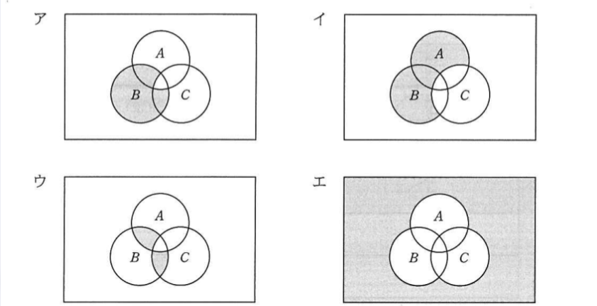
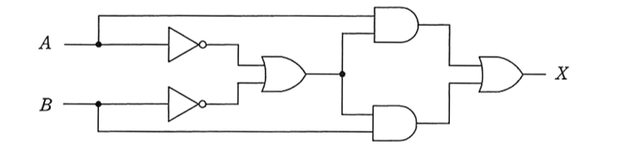
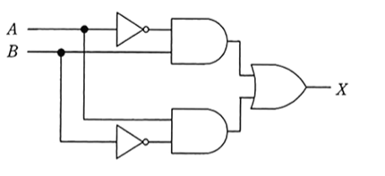

# Day02（2026/06/25）
## 学習結果

- 実施問題数：10問
- 正解：6問
- 不正解：4問
- 正答率：60%
- 学習時間：3時間30分
- 今日一番の学び：オーバーフローは、同じ符号同士を足したときに起こる

---

## 学習内容

### 誤差

- 丸め誤差
- 桁落ち
- 情報落ち
- けたあふれ誤差（オーバーフロー）

---

### 集合・論理演算

- ベン図
- 論理式
- ド・モルガンの法則

---

### 論理回路と基本回路

- 論理積回路
- 論理和回路
- 否定回路
- 否定論理積回路（NAND）
- 否定論理和回路（NOR）
- 排他的論理和回路（EOR・XOR）

---

## 練習問題

### 問題１：正
浮動小数点形式で表現された数値の演算結果における丸め誤差の説明はどれか。

【選択肢】

1. 演算結果がコンピュータの扱える最大値を超えることによって生じる誤差である。
2. 数表現のけた数に限度があるので，最下位けたより小さい部分について四捨五入や切上げ，切捨てを行うことによって生じる誤差である。  
3. 乗除算において，指数部が小さい方の数値の仮数部の下位部分が失われることによって生じる誤差である。  
4. 絶対値がほぼ等しい数値の加減算において，上位の有効数字が失われることによって生じる誤差である。  

回答：２   

<details><summary>【解答・解説】</summary><div>
答え：２<br>
<br>
丸め誤差は「四捨五入」「切り捨て」「切り上げ」がキーワード</div></details>

---

### 問題２：正
桁落ちの説明として，適切なものはどれか。

【選択肢】

1. 値がほぼ等しい浮動小数点同士の減算において，有効けた数が大幅に減ってしまうことである。
2. 演算結果が，扱える数値の最大値を超えることによって生じる誤差のことである。
3. 数表現のけた数に限度があるとき，最小のけたより小さい部分について四捨五入，切上げ又は切捨てを行うことによって生じる誤差のことである。
4. 浮動小数点の加算において，一方の数値の下位のけたが結果に反映されないことである。  

回答：１

<details><summary>【解答・解説】</summary><div>
答え：１<br>
<br>
桁落ちは「値がほぼ等しい」「減算」がキーワード</div></details>

---

### 問題３：正
数多くの数値の加算を行う場合、絶対値の小さなものから順番に計算するとよい。これは、どの誤差を抑制する方法を述べたものか。

【選択肢】

1. アンダフロー
2. 打切り誤差
3. けた落ち
4. 情報落ち

回答：４

<details><summary>【解答・解説】</summary><div>
答え：４<br>
<br>
情報落ちは「絶対値の大きな値」と「絶対値の小さな値」の加減算を行ったときに、
絶対値の小さな値が計算結果に反映されない事によって生じる誤差。  
多くの数値を加算する場合は、絶対値の小さい値から順に加算することで、情報落ちを抑えられる。</div></details>

---

### 問題４：誤
浮動小数点数を、仮数部が7ビットである表示形式のコンピュータで計算した場合、情報落ちが発生しないものはどれか。  
ここで、仮数部が7ビットの表示形式とは次のフォーマットであり、（ ）内は2進数、Yは指数である。  
また、{ }内を先に計算するものとする。

(1) X₁ X₂ X₃ X₄ X₅ X₆ X₇ ₂ × 2ʸ

【選択肢】

1. { (1.1)₂ × 2⁻³ + (1.0)₂ × 2⁻⁴ } + (1.0)₂ × 2⁵
2. { (1.1)₂ × 2⁻³ - (1.0)₂ × 2⁻⁴ } + (1.0)₂ × 2⁵
3. { (1.0)₂ × 2⁵ + (1.1)₂ × 2⁻³ } + (1.0)₂ × 2⁻⁴
4. { (1.0)₂ × 2⁵ - (1.0)₂ × 2⁻⁴ } + (1.1)₂ × 2⁻³

回答：スキップ

<details><summary>【解答・解説】</summary><div>
答え：１<br>
<br>

| 選択肢 | 最初に計算する式 |        情報落ち        |  
| :-----: | :-------------: |:------------------:|  
| ①   | 0.1875 + 0.0625 | ❌ 発生しない（正解） |  
| ②   | 0.1875 - 0.0625 | ⭕ 発生する（次の32との加算時）  |  
| ③   | 32 + 0.1875     |       ⭕ 発生する       |  
| ④   | 32 - 0.0625     |       ⭕ 発生する       |

### <u>基本情報試験で覚えるコツ</u>
試験では、次のように判断すると速く解けます。

- 小さい数同士を先に計算 → 情報落ちしにくい  
- 最初に大きい数と小さい数を加減算 → 情報落ちしやすい  
- 小さい数同士を引いた後でも、その結果を大きい数と加減算すれば情報落ちは起こり得る

今回の問題では②が少し引っかけです。  
最初の減算では情報落ちはありませんが、その後に得られた小さな値（0.125）を32と加算する段階で情報落ちが発生するため、不正解となります。</div></details>

---

### 問題５：誤
演算レジスタが16ビットのCPUで符号付き16ビット整数 x1, x2 を16ビット符号付き加算（x1 + x2）する際に、全ての x1, x2 の組み合わせにおいて加算結果がオーバーフローしないものはどれか。  
ここで、|x| は x の絶対値を表し、負数は2の補数で表すものとする。

【選択肢】

1.  |x1| + |x2| ≦ 32,768 の場合
2.  |x1| 及び |x2| がともに 32,767 未満の場合
3.  x1 × x2 > 0 の場合
4.  x1 と x2 の符号が異なる場合

回答：スキップ  
※1,2はオーバーフローするところまではわかったが、  
　3と4で迷う。

<details><summary>【解答・解説】</summary><div>
答え：４<br>
<br>
16ビット符号付き整数の範囲は、

```text
-32768 ～ 32767
```

です。<br>
<br>
<mark>オーバーフローは、同じ符号同士を足したときに起こります。</mark><br>
<br>
正 + 正 → 32767 を超える可能性<br>
負 + 負 → -32768 より小さくなる可能性<br>
<br>
逆に、符号が異なる数同士の加算は、絶対値が打ち消し合う方向になるので、必ず範囲内に収まります。</div></details>

---

### 問題６：正
(Ā ∩ B ∩ C) ∪ (A ∩ B ∩ C̄) を網掛け部分（▨▨）で表しているベン図はどれか。  
ここで、∩ は積集合、∪ は和集合、 X̄は X の補集合を表す。



【選択肢】
1. ア
2. イ
3. ウ
4. エ

回答：ウ

<details><summary>【解答・解説】</summary><div>
答え：ウ<br>
<br>
Ā∩B∩C は「Aではない、かつB、かつC」<br>
A∩B∩C̄ は「AかつB、ただしCではない」<br>
それぞれの領域を和集合で合わせるため、答えはウ。<br>
</div></details>

---

### 問題７：正
論理式<span style="text-decoration: overline;">(Ā + B)・(A + C̄)</span>と等しいものはどれか。  
ここで、・は論理積、＋は論理和、X̄は X の補集合を表す。

【選択肢】
1. A・B̄ + Ā・C
2. Ā・B + A・C̄
3. (A + B̄)・(Ā + C)
4. (Ā + B̄)・(A + C̄)


回答：１

<details><summary>【解答・解説】</summary><div>
答え：１<br>
<br>
ド・モルガンの法則を利用して変形すると、選択肢①と同じ論理式になる。<br>
今回の学習では、A=0、B=1、C=1 などの値を代入して確認する方法でも正解を判別した。<br>
</div></details>

---

### 問題８：誤
X と Y の否定論理積 X NAND Y は，NOT(X AND Y) として定義される。  
X OR Y を NAND だけを使って表した論理式はどれか。

【選択肢】  
1. ((X NAND Y) NAND X) NAND Y
2. (X NAND X) NAND (Y NAND Y)
3. (X NAND Y) NAND (X NAND Y)
4. X NAND (Y NAND (X NAND Y))


回答：スキップ

<details><summary>【解答・解説】</summary><div>
答え：２<br>
<br>
NANDだけでORを作るには、まずNANDでNOTを作る。<br>
NANDは「NOT」と「AND」の両方を作れるため、全ての論理回路を表現できる。<br>
X NAND X = NOT X、Y NAND Y = NOT Y を利用し、最後にNANDを取ることで OR を表現できる。<br>
</div></details>

---

### 問題９：誤
図に示すディジタル回路と等価な論理式はどれか。


【選択肢】
1. X = A・B + Ā・B̄
2. X = A・B + <span style="text-decoration: overline;">(A・B)</span>
3. X = A・B̄ + Ā・B
4. X = <span style="text-decoration: overline;">(Ā + B)</span>・(A + B̄)


回答：スキップ

<details><summary>【解答・解説】</summary><div>
答え：３
<br>
回路を左から順番に論理式へ変換して解く。後日復習予定。<br>
NOT → AND → OR の順に論理式へ変換していくと整理しやすい。<br>
</div></details>

---

### 問題１０：誤
次の回路の入力と出力の関係として、正しいものはどれか。


【選択肢】
1. | A | B | X |
   |:-:|:-:|:-:|
   | 0 | 0 | 0 |
   | 0 | 1 | 0 |
   | 1 | 0 | 0 |
   | 1 | 1 | 1 |

2. | A | B | X |
   |:-:|:-:|:-:|
   | 0 | 0 | 0 |
   | 0 | 1 | 1 |
   | 1 | 0 | 1 |
   | 1 | 1 | 0 |

3. | A | B | X |
   |:-:|:-:|:-:|
   | 0 | 0 | 1 |
   | 0 | 1 | 0 |
   | 1 | 0 | 0 |
   | 1 | 1 | 0 |

4. | A | B | X |
   |:-:|:-:|:-:|
   | 0 | 0 | 1 |
   | 0 | 1 | 1 |
   | 1 | 0 | 1 |
   | 1 | 1 | 0 |


回答：スキップ

<details><summary>【解答・解説】</summary><div>
答え：２<br>
<br>
真理値表を作成し、各入力について回路の出力を確認することで求められる。<br>
回路図だけでは判断せず、A・Bを00、01、10、11の順に当てはめると確実に解ける。<br>
</div></details>

---

## 振り返り

- 浮動小数点数の誤差（丸め誤差・桁落ち・情報落ち）の違いは理解できてきたが、時間経過で忘れやすいところでもある。
- 情報落ちが発生する条件は、「大きい数と小さい数を先に加減算する」と覚えると判断しやすいことを理解した。
- オーバーフローは、同じ符号同士の加算で発生する可能性があることを理解した。
- ベン図や論理式は、式変形よりも具体的な値を代入して確認する方法の方が理解しやすかった。
- NAND回路はまだ慣れておらず、論理式への変換や真理値表の作成に時間がかかるため、復習が必要と感じた。
- 論理回路は、回路を左から順番に追って論理式へ変換する練習を続けたい。

## 次回重点的に復習すること
- NANDだけを使った論理式
- 論理回路から論理式への変換
- 真理値表の作成
- 情報落ち・桁落ち・丸め誤差の違い