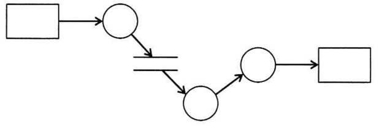

# Day03（2026/06/26）
## 学習結果

- 実施問題数：16問
- 正解：15問
- 不正解：1問
- 正答率：94%
- 学習時間：4時間12分

---

## 学習内容

### ウォータフォールモデル
上流工程から下流工程へ、滝のように流れる開発手法

- 基本計画
- 要件定義
  - 機能要件
  - 非機能要件
    - 可用性
    - 性能・拡張性
    - 運用・保守性
    - 移行性
    - セキュリティ
    - システム環境・エコロジー
- システム設計
  - 外部設計（基本設計）
  - 内部設計（詳細設計）
- プログラミング
- テスト
  - 単体テスト
  - 結合テスト（統合テスト）
  - システムテスト（総合テスト）
  - 運用テスト

---

### アジャイル開発
変化に対応しながら、短いサイクルで開発を進める手法
 
- アジャイルソフトウェア開発宣言
  * プロセスやツールよりも**個人と対話**を
  * 包括的なドキュメントよりも**動くソフトウェア**を
  * 契約交渉よりも**顧客との協調**を
  * 計画に従う事よりも**変化への対応**を  
  価値とする
- スクラム
  - スプリント（1週間の例）
    * １日目：スプリントプランニング・デイリースクラム・開発
    * ２日目：デイリースクラム・開発
    * ３日目：デイリースクラム・開発
    * ４日目：デイリースクラム・開発
    * ５日目：デイリースクラム・開発
    * ６日目：デイリースクラム・開発
    * ７日目：デイリースクラム・開発・スプリントレビュー・レトロスペクティブ
      * 開発者がスプリントバックログを作成  
      → 開発を行いインクリメントを作成  
      → スプリントレビューで成果物をプロダクトオーナーが確認  
      → レトロスペクティブで振り返り  
      → 次のスプリントに反映  
  - プロダクトオーナー
    * プロダクトバックログの責任者
    * プロダクトの**目標の明確化と共有**
    * プロダクトバックログの**作成・管理**
    * 優先順位の**明確化**
    * 開発段階の**監視**
    * 顧客の**要求の把握**
    * 顧客ニーズを**予測し反映**
  - スクラムマスタ
    * スクラムイベントが適切に行われるよう支援
    * スクラムチーム内外の問題解決
    * スクラムの理解と実践を支援
  - 開発者
    * スプリント計画の作成
    * プログラムなどの成果物（インクリメント）の作成
- XP（<ruby>eXtreme Programming<rp>(（</rp><rt>エクストリームプログラミング</rt><rp>)</rp></ruby>）
  - ５つの価値
    * コミュニケーション
    * シンプルさ
    * 勇気
    * 尊重
    * フィードバック
  - 主なプラクティス
    - イテレーション
      * 要件定義 → 設計 → 開発 → テスト　の一連のサイクルを短い期間で繰り返す手法や、その単位
    - ペアプログラミング
      - ドライバ
        * プログラミング
      - ナビゲータ
        * 方針確認
        * コードレビュー
        * 問題点の指摘
    - テスト駆動開発
      * 実装の前にテストを定め、そのテストをパスするように実装を行う
    - リファクタリング
      * 外部から見た動作を変えずに、内部のコード構造を改善する。
    - YAGNI
      * 「You Aren't Going to Need it.」の略。  
        今必要とされる機能だけのシンプルな実装に留める。
    - 継続的インテグレーション（CI）
      * 開発したコードを頻繁に結合し、自動ビルドや自動テストによって問題を早期に発見する。
    - 継続的デリバリー（CD）
      * いつでも本番環境へリリースできる状態を保つ

---

### 分析と設計

- DFD（<ruby>Data Flow Diagram<rp>(</rp><rt>データフローダイアグラム</rt><rp>)</rp></ruby>）
  - データの流れを表現する

    | 記号 | 名称     | 説明                          |
    |:--:|:-------|:----------------------------|
    | ▭  | 源泉・吸収  | データの発生元や最終的な行き先を表す          |
    | ＝  | データストア | ファイルやデータベースなど、データを保存する場所を表す |
    | ○  | プロセス   | データを加工したり変換したりする処理を表す       |
    | →  | データフロー | データの流れを表す                   |
  - E-R図
    * 実体（<ruby>Entity<rp>(</rp><rt>エンティティ</rt><rp>)</rp></ruby>）と、実体間の関連（<ruby>Relationship<rp>(</rp><rt>リレーションシップ</rt><rp>)</rp></ruby>）という概念を使って、データの構造を図に表したもの。  
      関連を表す矢印はそちらから見て相手が複数の場合は先頭に矢じりがつく。  

---

## 練習問題

### 問題１：正
要件定義の段階で行う作業はどれか。

【選択肢】
1. 新たに構築する業務とシステムの仕様を明確化し，システム化範囲を明示する。
2. 顧客が記述したニーズに合ったソフトウェアを開発する。
3. 事業の目的，目標を達成するために必要なシステム化の方針を立案する。 
4. ソフトウェア製品の運用及び利用者に対する運用支援を行う。

回答：１

【解答・解説】

答え：１ 
 
２・・・プログラミング 
３・・・基本計画 
４・・・運用・保守 
 

---

### 問題２：正
システム開発の最初の工程で行う作業として、適切なものはどれか。

【選択肢】
1. 各プログラムの内部構造を設計する。
2. 現状の業務を分析し、システム要件を整理する。
3. サブシステムをプログラム単位まで分割し、各プログラムの詳細を設計する。
4. ユーザインタフェースを設計する。

回答：２

【解答・解説】

答え：２ 
 
システム開発の最初の工程では、現状業務を分析し、システム要件を整理する。 
1・3は内部設計以降、4は外部設計に該当する。 
 

---

### 問題３：正
共通フレーム2007によれば、非機能要件に該当するものはどれか。  

【選択肢】
1. 新しい業務の在り方をまとめた上で、業務上実現すべき要件
2. 業務の手順や入出力情報、ルールや制約などの要件
3. 業務要件を実現するために必要なシステムの機能に関する要件
4. ソフトウェアの信頼性、効率性など品質に関する要件

**メモ：共通フレーム2007とは**  
共通フレーム2007とは、情報システムの企画、開発、運用、保守、廃棄に至るまでのソフトウェアライフサイクル全体において、作業内容や用語を定義したガイドラインです。  
発注側（ユーザー）と受注側（ベンダー）が認識のズレやトラブルを防ぎ、共通の言葉で話すための「共通のものさし」として策定されました。

回答：４

【解答・解説】

答え：４ 
 
１～３は<b>ヒアリングによって利用者から得られる要求事項にあたる</b>ので、機能要件となる。 
 

---

### 問題４：誤
非機能要件の定義に該当するものはどれか。

【選択肢】
1. 業務を構成する機能間の情報(データ)の流れを明確にする。
2. システム開発で利用する言語に合わせた開発基準，標準を作成する。
3. システム機能として実現する範囲を定義する。
4. 他システムとの情報授受などのインタフェースを明確にする。

回答：３

【解答・解説】

答え：２ 
 

| 選択肢 | 内容                    | 分類        |
| :---: | :---------------------: | :---------: |
| 1   | 機能間のデータの流れを明確にする      | 機能要件寄り    |
| 2   | 開発言語に合わせた開発基準・標準を作成する | **非機能要件** |
| 3   | システム機能として実現する範囲を定義する  | **機能要件**  |
| 4   | 他システムとのインタフェースを明確にする  | 機能要件寄り    |

### <u> 覚え方　　　　　　</u>

機能要件：何をできるようにするか 
非機能要件：どの品質・条件・制約で実現するか 
 

---

### 問題５：正
システムの外部設計を完了させるとき，顧客から承認を受けるものはどれか。

【選択肢】
1. 画面レイアウト
2. システム開発計画
3. 物理データベース使用
4. プログラム流れ図

回答：１

【解答・解説】

答え：１ 
 

**要件定義：**「何を作るか」を決める 
**外部設計：**「ユーザーから見える部分」を設計する 
**内部設計：**「どう作るか」を設計する 
**開発計画：**「いつ・誰が・どう進めるか」を決める 
 

---

### 問題６：正
外部設計及び内部設計の説明のうち，適切なものはどれか。

【選択肢】
1. 外部設計ではシステムを幾つかのプログラムに分割し、内部設計ではプログラムごとのDFDを作成する。
2. 外部設計ではデータ項目を洗い出して論理データ構造を決定し、内部設計では物理データ構造、データの処理方式やチェック方式などを決定する。
3. 外部設計と内部設計の遂行順序は、基本計画における利用者の要求に基づいて決定される。
4. 外部設計はコンピュータ側から見たシステム設計であり、内部設計は利用者側から見たシステム設計である。

回答：２

**用語メモ：**
- DFD（Data Flow Diagram：データフロー図）  
    データがどこから来て、どこへ流れ、どのように処理されるかを表した図。  
    フローチャートとの違いは、フローチャートが「プログラムの処理手順」であることに対し、  
    DFDは「データの流れ」を表したもの。  
- 論理データ構造  
どんなデータを管理するかを決めた設計。  
<u>（例）社員管理システム　　　</u> 
    * 社員
      * 社員番号
      * 氏名
      * 住所
    * 部署
      * 部署番号
      * 部署名  
    
    など、「どんなデータが必要なのか」**業務上必要なデータを設計したもの**。  
- 物理データ構造  
    論理データ構造を実際のデータベースへ落とし込んだもの。  
    データの型や、重複禁止・文字数上限等の保存方法を決める。  

【解答・解説】

答え：２ 
 
「論理」と「物理」は混同しやすいですが、 

- 論理 = 業務目線（必要なデータを考える） 
- 物理 = コンピュータ目線（保存方法を考える） 

と区別すると、基本情報技術者試験の問題でも判断しやすくなります。   
 

---

### 問題７：正
ソフトウェア詳細設計書に関する記述として，適切なものはどれか。

【選択肢】
1. ソフトウェア詳細設計書には，システム結合テストのためのテスト仕様が含まれる。
2. ソフトウェア詳細設計書に基づいてプログラミングが実施される。
3. ソフトウェア詳細設計書は，システム要件定義の終了を契機として作成が開始される。
4. ソフトウェア詳細設計書は，将来のメンテナンス用として，単体テストが完了した後で完成させる。

回答：２ 

【解答・解説】

答え：２ 
 

1. システム結合テストとは、
    プログラムA → プログラムB → プログラムC  
　　が連携して正しく動くか確認するテストのことで、テスト仕様書は**テスト設計**で作成する。
2. 正解：**詳細設計書＝プログラマ向けの設計図**
3. 要件定義 → **外部設計** → 詳細設計 の工程で進みます。  
　　要件定義の終了後に詳細設計には進みません。  
4. 詳細設計 → プログラミング　→ 単体テスト の工程順で進みます。  
　　詳細設計はプログラミング前に作成するもので、単体テスト完了後に完成させるものではありません。  

 

---

### 問題８：正
アジャイル開発手法の一つであるスクラムで定義され、  
スプリントで実施するイベントのうち、毎日決まった時間に決まった場所で行い、  
開発チームの全員が前回からの進捗状況や今後の作業計画を共有するものはどれか。

【選択肢】
1. スプリントプランニング
2. スプリントレトロスペクティブ
3. スプリントレビュー
4. デイリースクラム

回答：４

【解答・解説】

答え：４ 
 

---

### 問題９：正
スクラムチームにおけるプロダクトオーナーの役割はどれか。

【選択肢】
1. 生み出されるプロダクトの価値を最大化するために，プロダクトバックログのアイテムを作成し，並び替える。
2. 完成の定義を忠実に守ることにより品質を作り込み，利用可能なインクリメントを完成させる。
3. スプリントの計画を作成する。
4. チームのリーダとして，自己管理型で機能横断型のチームのメンバーをコーチする。

回答：１

【解答・解説】

答え：１ 
 

---

### 問題１０：正
ソフトウェア開発の活動のうち，アジャイル開発においても重視されているリファクタリングはどれか。

【選択肢】
1. ソフトウェアの品質を高めるために，2人のプログラマが協力して，一つのプログラムをコーディングする。
2. ソフトウェアの保守性を高めるために，外部仕様を変更することなく，プログラムの内部構造を変更する。
3. 動作するソフトウェアを迅速に開発するために，テストケースを先に設定してから，プログラムをコーディングする。
4. 利用者からのフィードバックを得るために，提供予定のソフトウェアの試作品を早期に作成する。

回答：２

【解答・解説】

答え：２ 
 

---

### 問題１１：正
XP（エクストリームプログラミング）において、実践することが提唱されているものはどれか。

【選択肢】
1. 構造化設計
2. テストツールの活用
3. ペアプログラミング
4. ユースケースの活用

回答：３

【解答・解説】

答え：３ 
 

---

### 問題１２：正
エクストリームプログラミング（XP）のプラクティスのうち、  
プログラム開発において相互に役割を交替し、チェックし合うことによってコミュニケーションを円滑にし、  
プログラムの品質向上を図るものはどれか。

【選択肢】
1. 計画ゲーム
2. コーディング標準
3. テスト駆動開発
4. ペアプログラミング

回答：４

【解答・解説】

答え：４ 
 

---

### 問題１３：正
DFDの表記方法として、適切なものはどれか。

【選択肢】
1. 2本の平行線は同期を意味し、名前は付けない。
2. 円には、データを蓄積するファイルの名前を付ける。
3. 四角には、入力画面や帳票を表す名前を付ける。
4. 矢印には、データを表す名前を付ける。

回答：４

【解答・解説】

答え：４ 
 

---

### 問題１４：正
図は、構造化分析法で用いられるDFDの例である。  
図中の "〇" が表しているものはどれか。

【選択肢】
1. アクティビティ
2. データストア
3. データフロー
4. プロセス

回答：４

【解答・解説】

答え：４ 
 

---

### 問題１５：正
E-R図に関する記述のうち、適切なものはどれか。

【選択肢】
1. 関係データベースの表として実装することを前提に表現する。
2. 管理の対象をエンティティ及びエンティティ間のリレーションシップとして表現する。
3. データの生成から消滅に至るデータ操作を表現する。
4. リレーションシップは、業務上の手順を表現する。

回答：２

【解答・解説】

答え：２ 
 

---

### 問題１６：正
UMLを用いて表した図の概念データモデルの解釈として、適切なものはどれか。

【選択肢】
1. 従業員の総数と部署の総数は一致する。
2. 従業員は、同時に複数の部署に所属してもよい。
3. 所属する従業員がいない部署の存在は許されない。
4. どの部署にも所属しない従業員が存在してもよい。

回答：２

**用語メモ：**  
- UML
  * 主にオブジェクト指向分析・設計において用いられる統一モデリング言語 

【解答・解説】

答え：２ 
 

---

## 振り返り

- ウォータフォールモデルでは、基本計画・要件定義・外部設計・内部設計・プログラミング・テストの流れを整理できた。
- 外部設計は利用者から見える部分、内部設計は開発者・コンピュータ側から見た設計であることを理解した。
- 機能要件と非機能要件の違いはまだ迷いやすいが、「何をできるようにするか」と「どの品質・条件で実現するか」で区別すると判断しやすい。
- スクラムでは、プロダクトオーナー・スクラムマスタ・開発者の役割の違いを学んだ。
- XPでは、ペアプログラミング・テスト駆動開発・リファクタリング・CI/CDなどのプラクティスを整理できた。
- DFD、E-R図、UMLなど、分析・設計で使われる図の目的を区別して覚える必要がある。
