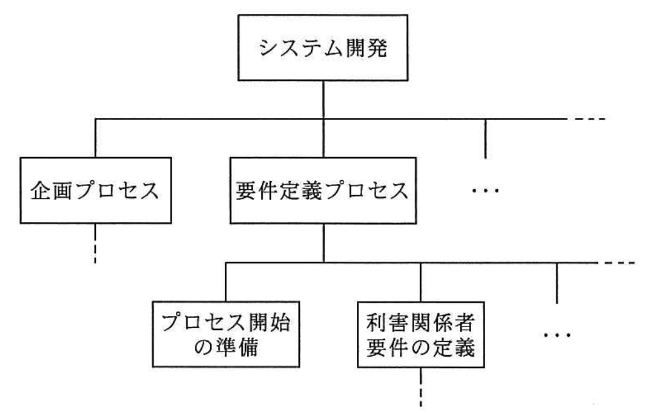
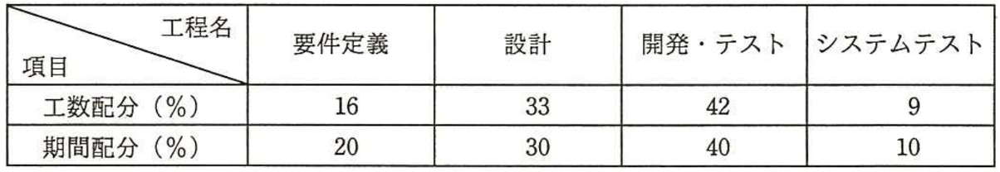
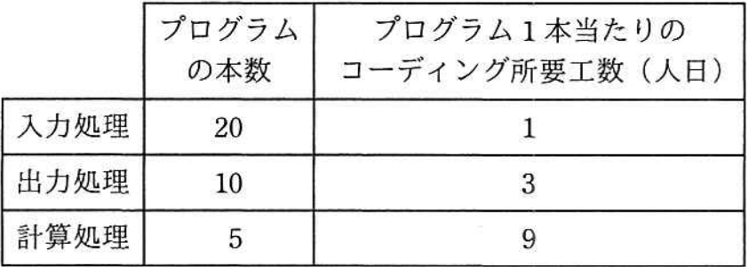
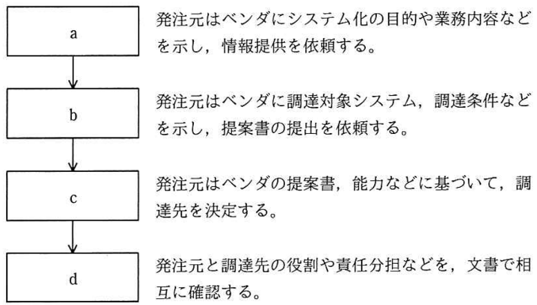
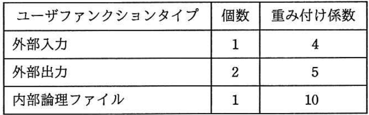
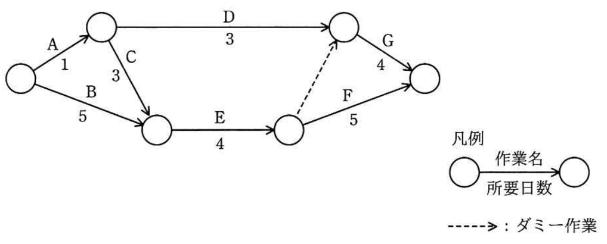
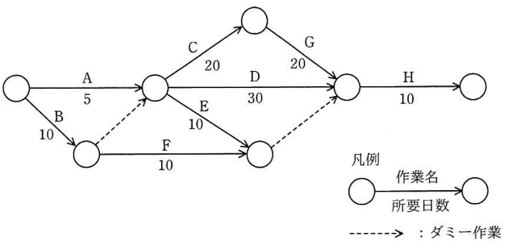
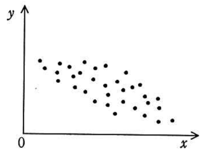

# Day06（2026/07/08）
## 学習結果

- 実施問題数：18問
- 正解：15問
- 不正解：3問
- 正答率：83%
- 学習時間：3時間10分

---

## 学習内容

### <ruby>PMBOK<rp>(</rp><rt>ピンボック</rt><rp>)</rp></ruby>（<ruby>Project Management Body Of Knowledge<rp>(（</rp><rt>プロジェクト マネジメント ボディ オブ ナレッジ</rt><rp>)</rp></ruby>）

- プロセス群
  - 立ち上げ
  - 計画
  - 実行
  - 監視・コントロール
  - 終結
- 知識エリア
  - 統合マネジメント
    - 作業プロセス間の調整
  - スコープマネジメント
    - 作業範囲の明確化
    - WBS（<ruby>Work Breakdown Structure<rp>(</rp><rt>ワーク ブレイクダウン ストラクチャー</rt><rp>)</rp></ruby>）
      - プロジェクトに必要な作業や成果物を階層化した図であらわすもの。<br>
        最下層をワークパッケージ、ワークパッケージのための作業をアクティビティと言う。
    - プロジェクトのスコープ
      - 含まれる作業
        - 現行サイトの要件調査と分析
        - デザイン案の作成およびレビュー
        - コーディングとテスト（機能テスト、UIテスト、負荷テスト）
        - 新CMSへの既存コンテンツの移行
        - サイト公開後の初期運用サポート（１か月間）
      - 除外される作業
        - サーバーのインフラ構築および保守（既存インフラを使用）
        - カスタム機能（API統合、特注ソフトウェア）
        - 追加コンテンツ作成（既存コンテンツのみを移行）
  - スケジュールマネジメント
    - 作業スケジュールの管理
    - ガントチャート
      - 「いつ」「何をやるか」を表した棒状のチャート
    - アローダイアグラム
      - 作業の流れとそこに要する日数を図に表したもの。<br>
        PERTという工程管理手法を用いたPERT図と同じもの。
  - コミュニケーションマネジメント
    - 情報の伝達と共有
  - ステークホルダーマネジメント
    - 利害関係者の特定と利害調整
  - 調達マネジメント
    - 外部への発注検討と実施
      ```mermaid
      flowchart TB
      A[情報提供の依頼] --> B[提案依頼書の作成と提出] --> C[提案書の受け取り] --> 
      D[見積書の受け取り] --> E[システムベンダの選定] 
      ```
    - RFI（<ruby>Request For Information<rp>(</rp><rt>リクエスト フォー インフォメーション</rt><rp>)</rp></ruby>）
      - 発注側がシステムベンダに提出する、情報提供依頼書。<br>
        最新の導入事例などの提供を依頼する。
    - RFP（<ruby>Request For Proqosal<rp>(</rp><rt>リクエスト フォー プロポーザル</rt><rp>)</rp></ruby>）
      - 発注側がシステムベンダに提出する提案依頼書。<br>
        システムの内容や予算などの諸条件をまとめて提出する。
  - リスクマネジメント
    - 潜在リスクの識別と管理
    - リスクとチャンスをコントロールする役割
  
        <table>
          <tr>
            <th colspan = "2">チャンス</th>
            <th colspan = "2">リスク</th>
          </tr>
          <tr>
            <td>活用</td>
            <td>チャンスの発生確率を100%にすることを目指す。</td>
            <td>回避</td>
            <td>リスクの発生確率を0%にすることを目指す。</td>
          </tr>
          <tr>
            <td>共有</td>
            <td>第三者と組んでチャンスを獲得する。</td>
            <td>転嫁</td>
            <td>悪影響を第三者に移しリスクの影響を下げる。</td>
          </tr>
          <tr>
            <td>強化</td>
            <td>チャンスの発生確率を上げる。<br>
                チャンスの影響を増やす。
            </td>
            <td>軽減</td>
            <td>リスクの発生確率を下げる。<br>
                リスクの影響を減らす。
            </td>
          </tr>
          <tr>
            <td>受容</td>
            <td>何もしない。</td>
            <td>受容</td>
            <td>何もしない。</td>
          </tr>
        </table>

  - 品質マネジメント
    - 品質基準の適合チェック
    - QC7つ道具
      - パレート図
        - 原因などの項目を件数順に並べた棒グラフと、累積値を折れ線グラフであらわしたもの
      - 散布図
        - 相関関係を表した点グラフ
      - 特性要因図
        - 要因（原因）と特性（結果）の関連を魚の骨のような形状で表現したもの
      - 管理図
        - 管理限界の上限と下限を明示し、異常の発見に用いる
      - ヒストグラム
        - データをいくつかの区間にわけた棒グラフ。<br>
          品質のばらつきの把握などに使用する。
      - チェックシート
        - 確認すべき項目をリスト化し、確認結果を記入していく。
      - 層別
        - データを属性ごとにグループ化することで、特徴を把握しやすくする考え方。
  - 資源マネジメント
    - 必要な要員の確保
  - コストマネジメント
    - 予算とかお金の管理
    - 類推法
      - 過去の似たプロジェクトを元に見積もる
    - プログラムステップ法
      - ソースコードの行（ステップ）数を元に開発コストを見積もる。
    - パラメトリック見積
      - 過去のデータを基に、特定のパラメータと数式を用いて精度の高い見積もりを行う。
    - ファンクションポイント法
      - 利用者から見える画面や印刷する帳票、出力ファイルなどに着目し、その個数や難易度からコストを算出する。
    - 積算法
      - 作業項目ごとに見積り、それらを合計する。
    - 三点見積法
      - 楽観値、悲観値、最頻値の３つの値を基に見積もる。
    - COCOMO
      - 予想されるプログラムの行数に、開発メンバーの能力や求められる信頼性などの係数を掛けて見積もる。<br>
        システム開発以外の分野でも使われている。

|          | 立ち上げ | 計画 | 実行 | 監視・コントロール | 終結 |
|----------| --- | --- | --- | --- | --- |
| 統合       | プロジェクト憲章の作成 | 計画書の作成 | 全体のマネジメント | 作業の監視、変更の管理 | フィードバック |
| ステークホルダー | ステークホルダー登録簿の作成 |ステークホルダーエンゲージメント計画書の作成 | ステークホルダーエンゲージメントの管理 | ステークホルダーエンゲージメントの監視 | |
| コミュニケーション | | コミュニケーションマネジメントの計画 | コミュニケーションマネジメントのマネジメント | コミュニケーションの監視 | |
| スコープ | | スコープの定義、WBSの作成 | | スコープのコントロール | |
| 資源 | | 資源マネジメントの計画 | チームの育成、管理 | 資源のコントロール | |
| 調達 | | 調達マネジメントの計画 | 調査の実行 | 調達のコントロール | |
| コスト | | 見積り、予算の設定 | | コストのコントロール | |
| スケジュール | | スケジュールの作成 | | スケジュールのコントロール | |
| リスク | | リスクの特定、分析、評価 | リスク対応 | リスクの監視 | |
| 品質 | | 品質マネジメントの計画 | 品質のマネジメント | 品質のコントロール | |

---

## 練習問題

### 問題１：✅
プロジェクトマネジメントの活動には、プロジェクト統合マネジメント、プロジェクトスコープマネジメント、プロジェクトスケジュールマネジメント、プロジェクトコストマネジメントなどがある。<br>
プロジェクト統合マネジメントの活動には、資源配分を決め、議論する目標や代替案のトレードオフを調整することが含まれる。<br>
システム開発プロジェクトにおいて、当初の計画にはない機能の追加を行う場合のプロジェクト統合マネジメントの活動として、適切なものはどれか。

【選択肢】
1. 機能追加に掛かる費用を見積もり、必要な予算を確保する。
2. 機能追加に対応するために、納期を変更するか要員を追加するかを検討する。
3. 機能追加のために必要な作業内容を明確にし、WBSを更新する。
4. 機能追加のための所要期間を見積もり、スケジュールを変更する。

回答：２

<details><summary>【解答・解説】</summary><div>
答え：２<br>
<br>
</div></details>

---

### 問題２：✅
A社がB社にシステム開発を発注し、システム開発プロジェクトを開始した。<br>
プロジェクトの関係者①～④のうち、プロジェクトのステークホルダとなるものだけを全て挙げたものはどれか。

①A社の経営者<br>
②A社の利用部門<br>
③B社のプロジェクトマネージャ<br>
④B社を技術支援する協力会社<br>

【選択肢】
1. ①、②、④
2. ①、②、③、④
3. ②、③、④
4. ②、④

回答：２

<details><summary>【解答・解説】</summary><div>
答え：２<br>
<br>
</div></details>

---

### 問題３：✅
プロジェクト管理におけるプロジェクトスコープの説明として、適切なものはどれか。

【選択肢】
1. プロジェクトチームの役割や責任
2. プロジェクトで実施すべき作業
3. プロジェクトで実施する各作業の開始予定日と終了予定日
4. プロジェクトを実施するために必要な費用

回答：２

<details><summary>【解答・解説】</summary><div>
答え：２<br>
<br>
</div></details>

---

### 問題４：✅
図のように、プロジェクトチームが実行すべき作業を上位の階層から下位の階層へ段階的に分解したものを何と呼ぶか。<br>


【選択肢】
1. CPM
2. EVM
3. PERT
4. WBS

回答：４

<details><summary>【解答・解説】</summary><div>
答え：４<br>
<br>
</div></details>

---

### 問題５：❌
開発期間10か月、開発工数200人月のプロジェクトを計画する。<br>
次の配分表を前提とすると、ピーク時の要員は何人か。<br>
ここで、各工程の開始から終了までの要員数は一定とする。<br>


【選択肢】
1. 18
2. 20
3. 21
4. 22

回答：３

<details><summary>【解答・解説】</summary><div>
答え：４<br>
<br>
① 各工程の工数

| 工程 |	工数配分 | 工数 |
| --- | --- | --- |
| 要件定義 | 16%	| 200×0.16＝32人月 |
 |設計 |	33%	| 200×0.33＝66人月 |
| 開発・テスト | 42% | 200×0.42＝84人月 |
| システムテスト | 9%	| 200×0.09＝18人月 |

② 各工程の期間

| 工程      | 期間配分 |          期間 |
| ------- | ---: | ----------: |
| 要件定義    |  20% | 10×0.20＝2か月 |
| 設計      |  30% | 10×0.30＝3か月 |
| 開発・テスト  |  40% | 10×0.40＝4か月 |
| システムテスト |  10% | 10×0.10＝1か月 |

③ 各工程の要員数

| 工程      | 工数 | 期間 | 要員数 |
| ------- | -: | -: | --: |
| 要件定義    | 32 |  2 | 16人 |
| 設計      | 66 |  3 | 22人 |
| 開発・テスト  | 84 |  4 | 21人 |
| システムテスト | 18 |  1 | 18人 |

④ ピーク時の要員数
最も多い工程は

* 要件定義：16人
* 設計：22人
* 開発・テスト：21人
* システムテスト：18人

したがって、<br>
**ピーク時の要員数は 22人です。**
<br>
</div></details>

---

### 問題６：✅
10人が0.5kステップ／人日の生産性で作業するとき、30日間を要するプログラミング作業がある。<br>
10日目が終了した時点で作業が終了したステップ数は、10人の合計で30kステップであった。<br>
予定の30日間でプログラミングを完了するためには、少なくとも何名の要員を追加すればよいか。<br>
ここで、追加する要員の生産性は、現在の要員と同じとする。

【選択肢】
1. 2
2. 7
3. 10
4. 20

回答：３

<details><summary>【解答・解説】</summary><div>
答え：３<br>
<br>
</div></details>

---

### 問題７：✅
システムを構成するプログラムの本数とプログラム1本当たりのコーディング所要工数が表のとおりであるとき、システムを95日間で開発するには少なくとも何人の要員が必要か。<br>
ここで、システムの開発にはコーディングのほかに、設計及びテストの作業が必要であり、それらの作業にはコーディング所要工数の8倍の工数が掛かるものとする。<br>


【選択肢】
1. 8
2. 9
3. 12
4. 13


回答：２<br>

<details><summary>【解答・解説】</summary><div>
答え：２<br>
<br>
</div></details>

---

### 問題８：✅
図に示す手順で情報システムを調達するとき、b に入れるものはどれか。


【選択肢】
1. RFI
2. RFP
3. 供給者の選定
4. 契約の締結

回答：２

<details><summary>【解答・解説】</summary><div>
答え：２<br>
<br>
</div></details>

---

### 問題９：✅
あるソフトウェアにおいて、機能の個数と機能の複雑度に対する重み付け係数は表のとおりである。<br>
このソフトウェアのファンクションポイント値は幾らか。<br>
ここで、ソフトウェアの全体的な複雑さの補正係数は 0.75 とする。<br>


【選択肢】
1. 18
2. 24
3. 30
4. 32

回答：１

<details><summary>【解答・解説】</summary><div>
答え：１<br>
<br>
未調整FP<br>
= (1×4) + (2×5) + (1×10)<br>
= 24<br>

FP<br>
= 24 × 0.75<br>
= 18<br>
<br>
</div></details>

---

### 問題１０：✅
ソフトウェア開発の見積方法の一つであるファンクションポイント法の説明として、適切なものはどれか。

【選択肢】
1. 開発規模が分かっていることを前提として、工数と工期を見積もる方法である。ビジネス分野に限らず、全分野に適用可能である。
2. 過去に経験した類似のソフトウェアについてのデータを基にして、ソフトウェアの相違点を調べ、同じ部分については過去のデータを使い、異なった部分は経験に基づいて、規模と工数を見積もる方法である。
3. ソフトウェアの機能を入出力データ数やファイル数などによって定量的に計測し、複雑さによる調整を行って、ソフトウェア規模を見積もる方法である。
4. 単位作業項目に通用する作業量の基準値を決めておき、作業項目を単位作業項目まで分解し、基準値を適用して算出した作業量の積算で全体の作業量を見積もる方法である。


回答：３

<details><summary>【解答・解説】</summary><div>
答え：３<br>
<br>
</div></details>

---

### 問題１１：✅
ガントチャートを説明したものはどれか。

【選択肢】
1. 作業別に作業内容とその実施期間を棒状に図示したものであり、作業の予定や実績を示す場合に効果的である。
2. 散点グラフにプロットされた要素の、比較的短期間での座標上の移動変化を示す場合に効果的である。
3. 複数の属性項目の値を線で結び、その値のバランスを評価する場合に効果的である。
4. 棒グラフと折れ線グラフを組み合わせ、管理上の優先度を明示する場合に効果的である。


回答：１

<details><summary>【解答・解説】</summary><div>
答え：１<br>
<br>
</div></details>

---

### 問題１２：✅
あるプロジェクトの日程計画をアローダイアグラムで示す。クリティカルパスはどれか。<br>


【選択肢】
1. A, C, E, F
2. A, D, G
3. B, E, F
4. B, E, G

回答：３

<details><summary>【解答・解説】</summary><div>
答え：３<br>
<br>
</div></details>

---

### 問題１３：❌
図のアローダイアグラムから読み取れることとして、適切なものはどれか。<br>
ここで、プロジェクトの開始日を1日目とする。<br>


【選択肢】
1. 作業Cを最も早く開始できるのは6日目である。
2. 作業Dはクリティカルパス上の作業である。
3. 作業Eの総余裕日数は30日である。
4. 作業Eを最も遅く開始できるのは11日目である。


回答：４

<details><summary>【解答・解説】</summary><div>
答え：３<br>
<br>
</div></details>

---

### 問題１４：❌
プロジェクトのリスクに対応する戦略として，損害発生時のリスクに備え，損害賠償保険に加入することにした。<br>
PMBOKによれば，該当する戦略はどれか。

【選択肢】
1. 回避
2. 軽減
3. 受容
4. 転嫁

回答：２

<details><summary>【解答・解説】</summary><div>
答え：４<br>

#### なぜ「軽減」ではないのか

保険に入ることで事故が減るわけではありません。

例えば交通事故で考えると、
* 保険加入 → 事故の件数は変わらない
* 安全運転講習 → 事故が減る

つまり<br>
保険加入 **＝ 事故後の負担を他人へ渡す**<br>

なので転嫁です。<br>
<br>
一方
* 安全教育
* レビュー
* テスト
は事故そのものを減らすので軽減になります。<br>
<br>
</div></details>

---

### 問題１５：❌
PMBOKによれば，プロジェクトのリスクマネジメントにおいて，脅威に対して適用できる対応戦略と好機に対して適用できる対応戦略がある。<br>
脅威に対して適用できる対応戦略はどれか。

【選択肢】
1. 活用
2. 強化
3. 共有
4. 受容

回答：２

<details><summary>【解答・解説】</summary><div>
答え：４<br>
<br>
リスクには、プラスのリスク（チャンス）と、マイナスのリスクがあります。<br>
１～３はチャンスに適用できる対応戦略になり、４の受容はチャンスとリスクの両方にあります。<br>
<br>
</div></details>

---

### 問題１６：✅
プロジェクトで発生した課題の傾向を分析するために、<br>
ステークホルダ、コスト、スケジュール、品質などの管理項目別の課題件数を棒グラフとして件数が多い順に並べ、<br>
この順で累積した課題件数を折れ線グラフとして重ね合わせた図を作成した。この図はどれか。

【選択肢】
1. 管理図
2. 散布図
3. 特性要因図
4. パレート図

回答：４

<details><summary>【解答・解説】</summary><div>
答え：４<br>
<br>
</div></details>

---

### 問題１７：✅
生産物の品質を時系列に表し、生産工程が管理限界内で安定した状態にあるかどうかを判断するための図はどれか。

【選択肢】
1. 管理図
2. 散布図
3. 特性要因図
4. パレート図

回答：１

<details><summary>【解答・解説】</summary><div>
答え：１<br>
<br>
</div></details>

---

### 問題１８：✅❌
図は、製品の製造上のある要因の値 𝑥と品質特性の値 𝑦 との関係をプロットしたものである。この図から読み取れることはどれか。<br>


【選択肢】
1. 𝑥 から 𝑦 を推定するためには、2次回帰係数の計算が必要である。
2. 𝑦 から 𝑥 を推定するための回帰式は、𝑥 から 𝑦 を推定する回帰式と同じである。
3. 𝑥 と 𝑦 の相関係数は正である。
4. 𝑥 と 𝑦 の相関係数は負である。

回答：４

<details><summary>【解答・解説】</summary><div>
答え：４<br>
<br>
</div></details>

---

## 振り返り

- PMBOKの10知識エリアと5つのプロセス群の関係を整理できた。
- プロジェクト管理で使われる見積手法（FP法・COCOMO・プログラムステップ法など）の違いを理解した。
- ガントチャート、アローダイアグラム、WBSなど工程管理手法の特徴を整理できた。
- QC7つ道具（パレート図・散布図・管理図・特性要因図など）の用途を理解した。
- リスク対応戦略では「軽減」と「転嫁」の違いが曖昧だったため、保険は「転嫁」、レビューやテストは「軽減」と覚える。
- アローダイアグラムではクリティカルパスだけでなく、総余裕日数の計算方法も復習が必要だと感じた。
- 工数・工期・要員数を求める計算問題は、公式ではなく「工数÷期間＝要員数」の考え方を意識すると解きやすかった。