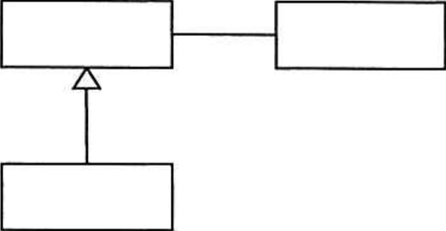

# Day04（2026/06/27）
## 学習結果

- 実施問題数：7問
- 正解：6問
- 不正解：1問
- 正答率：86%
- 学習時間：1時間15分

---

## 学習内容

### UML

分析や設計で使われる１４種類の記述方法

- 構造図
  - クラス図
    * クラスの構成と他のクラスとの関係を表現
  - オブジェクト図
    * クラスに、実際に値をいれた状態（オブジェクト）を表現
  - パッケージ図
    * クラスなどがどのようにグループ化されているかをあらわす
  - コンポーネント図
    * コンポーネント間の関係を図示
  - 複合構造図
    * 複数クラスを内包するクラスやコンポーネントの内部構造をあらわす
  - 配置図
    * システムを構成する物理的な構造をあらわす
- 振る舞い図
  - ユースケース図
    * 利用者の目線で、何ができるかを棒人間（アクター）を使った図で表現
  - アクティビティ図
    * 処理の流れを表現
  - ステートマシン図（状態遷移図）
    * イベントによって起こる、オブジェクトの状態遷移をあらわす
  - シーケンス図
    * 順番を時系列で表現する
  - コミュニケーション図
    * オブジェクト間のメッセージの流れを図示
  - 相互作用概要図
    * ユースケース図やシーケンス図などを構成要素として、より大枠の処理の流れをあらわす。
    アクティビティ図の変形
  - タイミング図
    * オブジェクトの状態遷移を時系列であらわす

---

## 練習問題

### 問題１：正
設計するときに、状態遷移図を用いることが最も適切なシステムはどれか。

【選択肢】
1. 月末及び決算時の棚卸資産を集計処理する在庫棚卸システム
2. システム資源の日次の稼働状況を、レポートとして出力するシステム資源稼働状況報告システム
3. 水道の検針データを入力として、料金を計算する水道料金計算システム
4. 設置したセンサの情報から、室内の環境を最適に保つ温室制御システム

回答：４

【解答・解説】

答え：４ 
 
状態遷移図（<ruby>State Transition Diagram<rp>(</rp><rt>ステートトランジションダイアグラム</rt><rp>)</rp></ruby>）は、 
<mark>システムの状態が、ある出来事（イベント）によってどのように変化するか</mark>を表す図です。 
自動ドアの、
現在の状態（閉） 
↓ 
状態を変えるきっかけ（人が近づく） 
↓ 
次の状態（開） 
のような状態の遷移を表現します。

設計図の種類は選択肢を見ると判断できる事が多い。

| キーワード                |    適した図     |
|:---------------------|:-----------:|
| 状態が変わる・ON/OFF・待機・制御  |  **状態遷移図**  |
| データの流れ               |     DFD     |
| データベース設計             |    E-R図     |
| 処理の順番                |   フローチャート   |

---

### 問題２：誤
UMLにおける振る舞い図の説明のうち、アクティビティ図のものはどれか。

【選択肢】
1. ある振る舞いから次の振る舞いへの制御の流れを表現する。
2. オブジェクト間の相互作用を時系列で表現する。
3. システムが外部に提供する機能と、それを利用する者や外部システムとの関係を表現する。
4. 一つのオブジェクトの状態がイベントの発生や時間の経過とともにどのように変化するかを表現する。

回答：２

【解答・解説】

答え：１ 
 
アクティビティ図はフローチャートを発展させた図で、 
処理の流れだけでなく、 
 
・分岐 
・並行処理 
・同期 
 
まで表現できる。 
「制御の流れ」と「流れ図」を結び付けて覚える。 

---

### 問題３：正
UML 2.0において、オブジェクト間の相互作用を時系列に表す図はどれか。

【選択肢】
1. アクティビティ図
2. コンポーネント図
3. シーケンス図
4. 状態遷移図

回答：３

【解答・解説】

答え：３ 
 
シーケンス（Sequence）は「順番」「時系列」の意味。 
 
オブジェクト同士がどの順番でメッセージをやり取りするかを表現する。 

---

### 問題４：正
UML2.0で定義している図のうち，動的な振る舞いを表現するものはどれか。

【選択肢】
1. オブジェクト図
2. クラス図
3. シーケンス図
4. パッケージ図

回答：３

【解答・解説】

答え：３ 
 
シーケンスとは、「流れ」「順番」の意味です。 
動的な振る舞いを表現できます。 
 

---

### 問題５：正
要件定義において、利用者や外部システムと、業務の機能を分離して表現することで、利用者を含めた業務全体の範囲を明らかにするために使用される図はどれか。

【選択肢】
1. アクティビティ図
2. オブジェクト図
3. クラス図
4. ユースケース図

回答：４

【解答・解説】

答え：４ 
 
ユース（利用）のケースです。 
誰が利用するかを表現します。 
 

---

### 問題６：正
UMLの図のうち、業務要件定義において、業務フローを記述する際に使用し、処理の分岐や並行処理、処理の同期などを表現できる図はどれか。

【選択肢】
1. アクティビティ図
2. クラス図
3. 状態マシン図
4. ユースケース図

回答：１

【解答・解説】

答え：１ 
 
アクティビティ図は業務フローを表現する図。 
 
処理の流れだけでなく、 
分岐・並列・同期も表現できる。 
 

---

### 問題７：正
UMLにおける図の長方形の中に記述するものはどれか。

【選択肢】
1. 関連名
2. クラス名
3. 集約名
4. ユースケース名

回答：２ 

【解答・解説】

答え：２ 
 
この図はクラス図です。 
クラス間の関連を表現するため、それぞれの箱はクラスです。 
 

---

## 振り返り

- UMLには構造図と振る舞い図があり、それぞれ役割が異なることを学んだ。
- アクティビティ図・シーケンス図・状態遷移図・ユースケース図の使い分けを整理できた。
- 状態遷移図は、状態がイベントによって変化するシステムの設計に適していることを理解した。
- 問題では「状態」「時系列」「利用者」「処理の流れ」などのキーワードから適切な図を判断できるようになってきた。
- UMLは名称が似ていて混同しやすいため、各図の目的を繰り返し復習したい。
