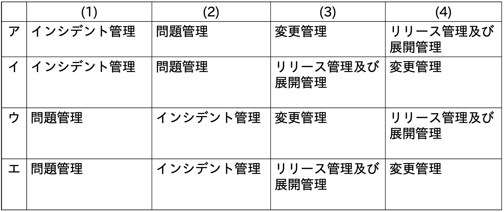
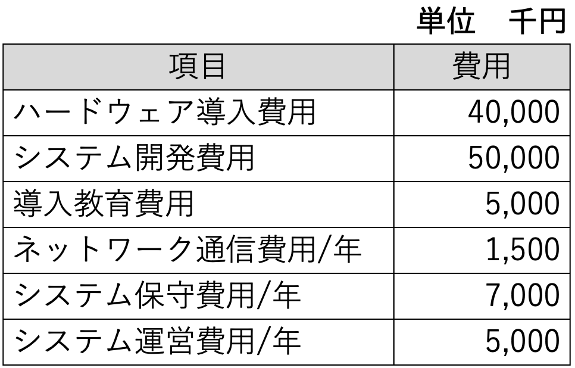

# Day07（2026/07/11）
## 学習結果

- 実施問題数：問
- 正解：問
- 不正解：問
- 正答率：%
- 学習時間：1時間30分

---

## 学習内容

### サービスマネジメントとは

- ITSMS
  - 運営システム全体
- JIS Q 20000
  - 基準
- <ruby>ITIL<rp>(</rp><rt>アイティル / アイティーアイエル</rt><rp>)</rp></ruby>
  （<ruby>Information Technology Infrastructure Library<rp>(</rp><rt>インフォメーション テクノロジー インフラストラクチャー ライブラリ</rt><rp>)</rp></ruby>）
  - 英国によってまとめられた、管理・運用規則に関する成功事例のこと
    - サービスサポート
      ```mermaid
      flowchart TB
        A[サービスデスク] --> B[インシデント管理] --> C[問題管理] --> D[構成管理]  --> 
        E[変更管理]  --> F[リリース管理]
        E[変更管理]  --> D[構成管理]
      ```
      - サービスデスク
        - ITサービスを利用する顧客と、ITサービスを提供する組織との間の一元的な窓口として活動する。
      - インシデント管理
        - 発生したインシデント（サービスを提供できなくなるかもしれない出来事）に対し、可能な限り迅速に通常のサービス運用を回復して、ビジネスへの悪影響を最小限に抑える。
      - 問題管理
        - インシデントのや問題の根本原因を特定し、事業に対する悪影響を最小限に抑制し、また再発を防止する。
      - 構成管理
        - 構成管理データベースシステムを用いてITサービス提供に必要な構成アイテム（CI）を常に正しく把握し、各プロセスに効果的な情報を提供する。
      - 変更管理
        - RFC（変更要求）の内容について、変更に伴う影響を検証してインパクトや優先度の評価を行い、認可または却下を決定する。
      - リリース管理
        - 承認の得られたコンポーネントを、正しい場所に、適切な時期にリリースする。
    - サービスデリバリ
      - サービスレベル管理
        - サービスの提供者とその利用者をとの間でSLAを締結し、PDCAサイクルによってサービスの維持、向上に努める。<br>
          モニタリングの結果に応じてSLAやプロセスを見直す。
        - SLA（<ruby>Service Level Agreement<rp>(</rp><rt>サービス レベル アグリーメント</rt><rp>)</rp></ruby>）
          - サービスの提供者とその利用者との間で、「どのような内容のサービスを、どういった品質で提供するか」と事前に取り決めて明文化したもの。<br>
            サービス品質の目標設定を、両社合意のもとで行う。
        - SLM（<ruby>Service Level Management<rp>(</rp><rt>サービス レベル マネジメント</rt><rp>)</rp></ruby>）
          - 設定した目標を達成するために、「 計画 - 実行 - 確認 - 改善 」というPDCAサイクルを構築し、<br>
            サービス水準の維持・向上に努める活動のこと。
      - キャパシティ管理
        - 容量、能力などシステムのキャパシティを管理し、最適なコストで、<br>
          サービスが現在および将来の合意された需要を満たすに足る十分な能力を持っていることを確実にする。
      - 可用性管理
        - サービスの利用者が利用したい時に確実にサービスを利用できるよう、<br>
          ITサービスを構成する個々の機能の維持管理を行う。
      - 継続性管理
        - 顧客と合意したサービス継続を、あらゆる状況の下で満たすことを確実にする。<br>
          具体的には、災害発生時であっても、最小時間でITサービスを復旧させ、事業継続のために必要な計画立案と試験を行う。
        - BCP（<ruby>Business Continuity Plan<rp>(</rp><rt>ビジネス コンティニュイティ プラン</rt><rp>)</rp></ruby>）
          - 企業が自然災害、大火災、テロ攻撃などの緊急事態に遭遇した場合において、<br>
            そうした自体が発生しても、重要な事業を中断させない、または中断し絵も可能な限り短い期間で復旧させるための方針、体制、手順などを示した計画のこと。
          - RLO（<ruby>Recovery Level Objective<rp>(</rp><rt>リカバリー レベル オブジェクティブ</rt><rp>)</rp></ruby>）
            - 復旧目標とする業務範囲や処理能力などを定める。
          - RTO（<ruby>Recovery Time Objective<rp>(</rp><rt>リカバリー タイム オブジェクティブ</rt><rp>)</rp></ruby>）
            - 目標復旧レベルまで復旧するのに要する時間を定める。
          - RPO（<ruby>Recovery Point Objective<rp>(</rp><rt>リカバリー ポイント オブジェクティブ</rt><rp>)</rp></ruby>）
            - どの時点のデータまでは復旧されるべきかを定める。
      - 財務管理
        - ITサービスに関わるコストの予測と、実際に発生したコストの計算や課金管理を行う。

---

## 練習問題

### 問題１：✅
ITサービスマネジメントにおいて，インシデント管理の対象となるものはどれか。

【選択肢】

1. ITサービスの新人への教育依頼
2. ITサービスやシステムの機能使い方に対する問合せ
3. アプリケーションの応答の大幅な遅延
4. 新設営業所へのITサービス提供要求

回答：３

<details><summary>【解答・解説】</summary><div>
答え：３<br>
<br>
</div></details>

---

### 問題２：✅
ITサービスマネジメントのインシデント及びサービス要求管理プロセスにおいて，インシデントに対して最初に実施する活動はどれか。

【選択肢】
1. 記録
2. 段階的取扱い
3. 分類
4. 優先度の割当て

回答：１

<details><summary>【解答・解説】</summary><div>
答え：１<br>
<br>
</div></details>

---

### 問題３：✅
ITサービスマネジメントの活動のうち，インシデント及びサービス要求管理として行うものはどれか。

【選択肢】
1. サービスデスクに対する顧客満足度が合意したサービス目標を満たしているかどうかを評価し、改善の機会を特定するためにレビューする。
2. ディスクの空き容量がしきい値に近づいたので、対策を検討する。
3. プログラムを変更した場合の影響度を調査する。
4. 利用者からの障害報告を受けて、既知の誤りに該当するかどうかを照合する。


回答：４

<details><summary>【解答・解説】</summary><div>
答え：４<br>
<br>
</div></details>

---

### 問題４：✅
ITサービスマネジメントにおける問題管理プロセスの活動はどれか。

【選択肢】
1. 根本原因の特定
2. サービス要求の優先度付け
3. 変更要求の記録
4. リリースの試験

回答：１

<details><summary>【解答・解説】</summary><div>
答え：１<br>
<br>
</div></details>

---

### 問題５：✅
ITサービスマネジメントにおけるインシデントの記録と問題の記録の関係についての記述のうち，適切なものはどれか。

【選択肢】
1. インシデントの分類とは異なる基準で問題を分類して記録する。
2. 問題の記録1件は、必ずインシデントの記録1件と関連付けられる。
3. 問題の記録には、問題の記録の発端となったインシデントの相互参照情報を含める。
4. 問題の記録の終了の際に既知の誤りが特定されていれば、問題の記録の発端と なったインシデントの記録を削除する。

回答：３

<details><summary>【解答・解説】</summary><div>
答え：３<br>
<br>
</div></details>

---

### 問題６：❌
ITIL v3における問題管理プロセスの目標はどれか。

【選択肢】
1. インシデントに対する既存ITサービスへの変更や新規サービスの導入を，効率的かつ安全に実施する。
2. インシデントによって中断したITサービスを，合意した時間内に復旧する。
3. インシデントの根本原因を突き止めて排除したり，インシデントの発生を予防したりする。
4. 利用者に単一窓口を提供し，事業への影響を最小限にして，通常サービスへ復帰できるように支援する。

回答：４

<details><summary>【解答・解説】</summary><div>
答え：３<br>
<br>
</div></details>

---

### 問題７：✅
サービスマネジメントシステムにおける問題管理の活動のうち、適切なものはどれか。

【選択肢】
1. 同じインシデントが発生しないように、問題は根本原因を特定して必ず恒久的に解決する。
2. 同じ問題が重複して管理されないように、既知の誤りは記録しない。
3. 問題管理の負荷を低減するために、解決した問題は直ちに問題管理の対象から除外する。
4. 問題を特定するために、インシデントのデータ及び傾向を分析する。

回答：４<br>

<details><summary>【解答・解説】</summary><div>
答え：４<br>
<br>
</div></details>

---

### 問題８：✅
ITサービスマネジメントの変更管理プロセスにおける変更要求の扱いのうち、適切なものはどれか。

【選択肢】
1. 緊急の変更要求に対応するために、変更による影響範囲などについてのアセスメントを実施せずに実装した。
2. 顧客からの変更要求だったので、他の変更要求より無条件に優先して実装した。
3. 変更要求を漏れなく管理するために、承認されなかった変更要求も記録した。
4. 法改正への対応だったので、変更に要するコストは見積もらずに実装した。

回答：３

<details><summary>【解答・解説】</summary><div>
答え：３<br>
<br>
</div></details>

---

### 問題９：✅
ソフトウェア開発プロジェクトで行う構成管理の対象項目として，適切なものはどれか。

【選択肢】
1. 開発作業の進捗状況
2. 成果物に対するレビューの実施結果
3. プログラムのバージョン
4. プロジェクト組織の編成

回答：３

<details><summary>【解答・解説】</summary><div>
答え：３<br>
<br>
</div></details>

---

### 問題１０：✅
JIS Q 20000-2:2013（サービスマネジメントシステムの適用の手引）によれば、構成管理プロセスの活動として、適切なものはどれか。

【選択肢】
1. 構成品目の総所有費用及び総減価償却費用の計算
2. 構成品目の特定、管理、記録、追跡、報告及び検証、並びにCMDBでのCI情報の管理
3. 正しい場所及び時間での構成品目の配付
4. 変更管理方針で定義された構成品目に対する変更要求の管理

回答：２

<details><summary>【解答・解説】</summary><div>
答え：２<br>
<br>
</div></details>

---

### 問題１１：✅
(1)～(4)はある障害の発生から本格的な対応までの一連の活動である。(1)～(4)の各活動とそれに対応するITIL v3の管理プロセスの組合せのうち、適切なものはどれか。

1. 利用者からサービスデスクに“特定の入力操作が拒否される”という連絡があったので、別の入力操作による回避方法を利用者に伝えた。
2. 原因を開発チームで追究した結果、アプリケーションプログラムに不具合があることが分かった。
3. 原因となったアプリケーションプログラムの不具合を改修する必要があるか否か、改修した場合に不具合箇所以外に影響がないかどうかについて、関係者を集めて確認し、改修することを決定した。
4. 改修したアプリケーションプログラムの稼働環境への適用については、利用者への周知、適用手順及び失敗時の切戻手順の確認など、十分な事前準備を行った。

<br>

【選択肢】
1. ア
2. イ
3. ウ
4. エ

回答：１

<details><summary>【解答・解説】</summary><div>
答え：１<br>
<br>
</div></details>

---

### 問題１２：✅
サービスマネジメントにおいて，サービスレベル管理の要求事項はどれか。

【選択肢】
1. サービス継続及び可用性に対するリスクを評価し，文書化する。
2. 提供するサービスのサービスカタログとSLAを作成し，顧客と合意する。
3. 人，技術，情報及び財務に関する資源を考慮して，容量・能力の計画を作成，実施及び維持する。
4. 予算に照らして費用を監視及び報告し，財務予測をレビューし，費用を管理する。

回答：２

<details><summary>【解答・解説】</summary><div>
答え：２<br>
<br>
</div></details>

---

### 問題１３：✅
SLAを策定する際の方針のうち，適切なものはどれか。

【選択肢】
1. 考えられる全ての項目に対し，サービスレベルを設定する。
2. 顧客及びサービス提供者のニーズ，並びに費用を考慮して，サービスレベルを設定する。
3. サービスレベルを設定する全ての項目に対し，ペナルティとしての補償を設定する。
4. 将来にわたって変更が不要なサービスレベルを設定する。

回答：２

<details><summary>【解答・解説】</summary><div>
答え：２<br>
<br>
</div></details>

---

### 問題１４：✅
BCPの説明はどれか。

【選択肢】
1. 企業の戦略を実現するために，財務，顧客，内部ビジネスプロセス，学習と成長という四つの視点から戦略を検討したもの
2. 企業の目標を達成するために業務内容や業務の流れを可視化し，一定のサイクルをもって継続的に業務プロセスを改善するもの
3. 業務効率の向上，業務コストの削減を目的に，業務プロセスを対象としてアウトソースを実施するもの
4. 事業の中断・阻害に対応し，事業を復旧し，再開し，あらかじめ定められたレベルに回復するための手順を規定したもの

回答：４

<details><summary>【解答・解説】</summary><div>
答え：４<br>
<br>
</div></details>

---

### 問題１５：✅
事業継続計画で用いられる用語であり、インシデントの発生後、次のいずれかの事項までに要する時間を表すものはどれか。

1. 製品又はサービスが再開される。
2. 事業活動が再開される。
3. 資源が復旧される。

【選択肢】
1. MTBF
2. MTTR
3. RPO
4. RTO

回答：４

<details><summary>【解答・解説】</summary><div>
答え：４<br>
<br>
</div></details>

---

### 問題１６：✅
サービスマネジメントにおいて，中断したサービスを復旧させるときの目標を定めた指標に，RTO(目標復旧時間)，RPO(目標復旧時点)及びRLO(目標復旧レベル)がある。RTOとRLOとを定めた例として，適切なものはどれか。

【選択肢】
1. サービスが中断する3時間前の時点の状態にデータを復旧し，利用者の50%以上にサービスを提供できるようにする。
2. サービスが中断する直前の状態にデータを復旧し，当日のサービス終了時刻を，サービスが中断していた時間だけ延長する。
3. サービスの中断から1時間以内に，中断する1時間前の時点の状態にデータを復旧する。
4. サービスの中断から1日以内に，中断したサービスのうちの重要なサービスに限定してサービスを復旧する。

回答：４

<details><summary>【解答・解説】</summary><div>
答え：４<br>
<br>
</div></details>

---

### 問題１７：✅
システムの費用を表すTCO(総所有費用）の意味として、適切なものはどれか。

【選択肢】
1. 業務システムの開発に関わる費用の総額
2. システム導入から運用及び維持・管理までを含めた費用の総額
3. システム導入の費用の総額
4. 通信・ネットワークに関わるシステムの運用費用の総額

回答：２

<details><summary>【解答・解説】</summary><div>
答え：２<br>
<br>
</div></details>

---

### 問題１８：✅
新システムの開発を計画している。<br>
このシステムの総所有費用（TCO)は何千円か。<br>
ここで、このシステムは開発された後、３年間使用されるものとする。<br>

<br>

【選択肢】
1. 40,500
2. 90,000
3. 95,000
4. 135,500

回答：４

<details><summary>【解答・解説】</summary><div>
答え：４<br>
<br>
</div></details>

---

## 振り返り


-
-
-
-
- 
