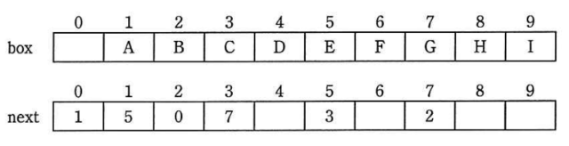
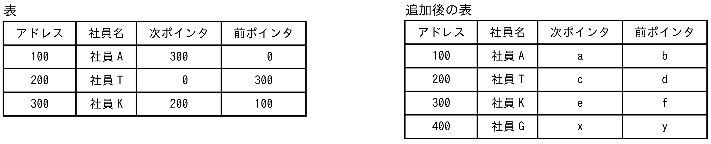

# Day08（2026/07/15）
## 学習結果

- 実施問題数：12問
- 正解：8問
- 不正解：4問
- 正答率：67%
- 学習時間：2時間30分

---

## 学習内容

### システム監査

- 内部統制
- システム監査人
  - 外観上の独立性
    - システム監査を客観的に実施する為に、監査対象から独立していなければならない。<br>
      監査の目的によっては、被監査主体と身分上、密接な利害関係を有する事があってはならない。
  - 精神上の独立性
    - システム監査の実施にあたり、偏向を排除し、常に公正かつ客観的に監査判断を行わなければならない。
  - 職業倫理と誠実性
    - 職業倫理に従い、誠実に業務を実施しなければならない。
  - 専門能力
    - 適切な教育と実務経験を通じて、専門職としての知識および技能を保持しなければならない。
- システム監査の手順
  - 監査計画の立案
    - 監査の目的を効率的に達成するための、監査手続きの内容とその時期、および範囲などについて適切な計画を立案します。
  - 予備調査
    - 本調査に先立ち、監査対象の実態把握に努めます。<br>
      資料の収集やアンケート調査など、被監査部門の実態調査を行い、適切なコントロールがなされているか確認します。
  - 本調査
    - 予備調査で作成した監査手続書に従い、現状の確認と、それを裏付ける監査証拠の収集、証拠能力の評価を行い、監査調書としてまとめます。
  - 評価・結論
    - 監査調書に基づいて、監査対象におけるコントロールの妥当性を評価します。<br>
      評価結果は監査報告書としてまとめ、その文書内に指摘事項や改善勧告などの監査意見を記します。
  ```mermaid
  flowchart TB
    A[監査計画の立案] 
    B[予備調査] 
    C[本調査]
    D["評価・結論"]
    E[監査報告]
    F[フォローアップ]
    
    A --> B --> C --> D --> E --> F
  ```
- システムの可監査性
  - 情報システムにおける可監査性とは、処理の正当性や内部統制を効果的に監査またはレビューできるようにシステムが設計・運用されていることを指します。
- 監査報告とフォローアップ
  - システム監査人は、監査報告書の記載事項について責任を負わなければなりません。<br>
    監査意見には大別すると<font color = "tomato">保証意見</font>と<font color = "tomato">助言意見</font>の２種類があり、当然そのいずれにおいても責を負います。

---

### リスト構造

- 単一データ
- 配列
  - メモリ上の連続した領域に、データを並べて管理すること
- リスト
  - 各要素がデータとポインタを持ち、ポインタによって次の要素（双方向リストでは前後の要素）の格納場所を示すデータ構造。
  - 配列のようにメモリ上で連続して配置される必要はない。
  - 単方向リスト
    - 次のデータへのポインタを持つリストです。
    - 最後尾の要素は、次の要素が存在しないことを示す終端値を持つ。（NULL、nil、0など）
    ```mermaid
    flowchart LR
    classDef transparent fill:transparent,stroke:transparent,stroke-width:0px;
        
        A["データ１ | 35"] 
        B["データ２ | 24"]
        C["データ３ | 72"]
        D["データ４ |  0"]
      
        A --> B --> C --> D
    ```
  - 双方向リスト
    - 次のデータへのポインタと、前のデータへのポインタを持つリストです。
    ```mermaid
      flowchart LR
      classDef transparent fill:transparent,stroke:transparent,stroke-width:0px;
        
          A[" 0 | データ１ | 35"] 
          B["10 | データ２ | 24"]
          C["35 | データ３ | 72"]
          D["24 | データ４ |  0"]
      
          A <--> B <--> C <--> D
    ```
  - 循環リスト
    - 次のデータへのポインタを持つリスト。<br>
      ただし、最後尾データは、先頭データへのポインタを持ちます。
    ```mermaid
    flowchart LR
    classDef transparent fill:transparent,stroke:transparent,stroke-width:0px;
        
        A["データ１ | 35"] 
        B["データ２ | 24"]
        C["データ３ | 72"]
        D["データ４ | 10"]
      
        A --> B --> C --> D --> A
    ```

---

## 練習問題

### 問題１：✅
"システム監査基準"における、組織体がシステム監査を実施する目的はどれか。

【選択肢】

1. 自社の強み・弱み、自社を取り巻く機会・脅威を整理し、新たな経営戦略・事業分野を設定する。
2. システム運用部門によるテストによって、社内ネットワーク環境の脆弱性を知り、ネットワーク環境を整備する。
3. 情報システムにまつわるリスクに対するコントロールの整備・運用状況を評価し、改善につなげることによって、ITガバナンスの実現に寄与する。
4. ソフトウェア開発の生産性のレベルを客観的に知り、開発組織の能力を向上させるために、より高い生産性レベルを目指して取り組む。

回答：３

<details><summary>【解答・解説】</summary><div>
答え：３<br>
<br>
</div></details>

---

### 問題２：✅
監査調書の説明はどれか。

【選択肢】
1. 監査人が行った監査手続の実施記録であり，監査意見の根拠となる。
2. 監査人が監査実施に当たり被監査部門に対して提出する，監査人自身のセキュリティ誓約書をまとめたものである。
3. 監査人が監査の実施に利用した基準書，ガイドラインをまとめたものである。
4. 監査人が正当な注意義務を払ったことを証明するために，監査報告書とともに公表するよう義務付けられたものである。

回答：１

<details><summary>【解答・解説】</summary><div>
答え：１<br>
<br>
</div></details>

---

### 問題３：✅
システム監査人がインタビューを実施時にすべきことのうち、最も適切なものはどれか。

【選択肢】
1. インタビューで監査対象部門から得た情報を裏付けるための文書や記録を入手するよう努める。
2. インタビューの中で気が付いた不備事項について、その場で監査対象部門に改善を指示する。
3. 監査対象部門の監査業務を経験したことのある管理者をインタビューの対象者として選ぶ。
4. 複数の監査人でインタビューを行うと記録内容に相違が出ることがあるので、1人の監査人が行う。

回答：１

<details><summary>【解答・解説】</summary><div>
答え：１<br>
<br>
</div></details>

---

### 問題４：❌
システムテストの監査におけるチェックポイントのうち、最も適切なものはどれか。

【選択肢】
1. テストケースが網羅的に想定されていること
2. テスト計画は利用者側の責任者だけで承認されていること
3. テストは実際に業務が行われている環境で実施されていること
4. テストは利用者側の担当者だけで行われていること

回答：３

<details><summary>【解答・解説】</summary><div>
答え：１<br>
<br>
システムテストの監査では、**「システムテストが適切に計画・実施されたか」** を確認します。<br>
<br>
そのため、重要なチェックポイントは、<br>

* テスト項目が十分か
* テストケースが漏れなく作成されているか
* テスト結果が記録されているか
* 障害への対応が適切か

などです。<br>
<br>
```
2. ② テスト計画は利用者側の責任者だけで承認されていること
```
「利用者側だけ」が誤りです。<br>
<br>
テスト計画は通常、<br>
<br>
* 開発側
* 利用者側
* プロジェクト責任者

など、関係者が承認します。<br>

```
3. テストは実際に業務が行われている環境で実施されていること
```
本番環境でシステムテストを行うことは通常ありません。<br>
<br>
一般的には、<br>

* テスト環境
* 本番と同等の検証環境

で実施します。<br>
<br>
```
4. テストは利用者側の担当者だけで行われていること
```
システムテストは、<br>

* 開発者
* 品質保証部門
* 利用者

などが役割分担して実施します。<br>

「**利用者だけ**」という限定は誤りです。<br>
<br>
#### 試験での覚え方
システム監査では次の視点を押さえると判断しやすくなります。

* 計画が適切か
* テストケースが十分か
* 証跡（結果・記録）が残っているか
* 承認が適切か

この中でも、基本情報技術者試験では「**テストケースの網羅性**」がよく問われます。<br>
<br>
#### 原因
- 「実際の業務環境に近いこと」と「本番環境で実施すること」を混同した。

#### 覚えること
- システムテストでは、本番環境そのものではなく、本番相当のテスト環境を使う。
- 監査では、テストケースの網羅性、証跡、承認、障害管理などを確認する。
- 「利用者側だけ」「開発側だけ」と限定する選択肢は疑って確認する。

</div></details>

---

### 問題５：✅
情報システム部が開発して経理部が運用している会計システムの運用状況を、経営者からの指示で監査することになった。<br>
この場合におけるシステム監査人についての記述のうち、最も適切なものはどれか。

【選択肢】
1. 会計システムは企業会計に関する各種基準に準拠すべきなので、システム監査人を公認会計士とする。
2. 会計システムは機密性の高い情報を扱うので、システム監査人は経理部長直属とする。
3. システム監査を効率的に行うために、システム監査人は情報システム部長直属とする。
4. 独立性を担保するために、システム監査人は情報システム部にも経理部にも所属しない者とする。

回答：４

<details><summary>【解答・解説】</summary><div>
答え：４<br>
<br>
</div></details>

---

### 問題６：✅
A社では、自然災害などの際の事業継続を目的として、業務システムのデータベースのバックアップを取得している。<br>
その状況について、「情報セキュリティ管理基準(平成28年)」に従って実施した監査結果として判明した状況のうち、監査人が指摘事項として監査報告書に記載すべきものはどれか。

【選択肢】
1. バックアップ取得手順書を作成し、取得担当者を定めていた。
2. バックアップを取得した電子記録媒体からデータベースを復旧する試験を、事前に定めたスケジュールに従って定期実施していた。
3. バックアップを取得した電子記録媒体を、機密保持を含む契約を取り交わした外部の倉庫会社に委託保管していた。
4. バックアップを取得した電子記録媒体を、業務システムが稼働しているサーバの近くで保管していた。

回答：４

<details><summary>【解答・解説】</summary><div>
答え：４<br>
<br>
</div></details>

---

### 問題７：✅
アクセス制御を監査するシステム監査人の行為のうち、適切なものはどれか。

【選択肢】
1. ソフトウェアに関するアクセス制御の管理台帳を作成し、保管した。
2. データに関するアクセス制御の管理規程を閲覧した。
3. ネットワークに関するアクセス制御の管理方針を制定した。
4. ハードウェアに関するアクセス制御の運用手続を実施した。

回答：２<br>

<details><summary>【解答・解説】</summary><div>
答え：２<br>
<br>
</div></details>

---

### 問題８：✅
データ構造の一つであるリストは，配列を用いて実現する場合と，ポインタを用いて実現する場合とがある。<br>
配列を用いて実現する場合の特徴はどれか。<br>
ここで，配列を用いたリストは，配列に要素を連続して格納することによって構成し，ポインタを用いたリストは，要素から次の要素へポインタで連結することによって構成するものとする。

【選択肢】
1. 位置を指定して、任意のデータに直接アクセスすることができる。
2. 並んでいるデータの先頭に任意のデータを効率的に挿入することができる。
3. 任意のデータの参照は効率的ではないが、削除や挿入の操作を効率的に行える。
4. 任意のデータを別の位置に移動する場合、隣接するデータを移動せずにできる。

回答：１

<details><summary>【解答・解説】</summary><div>
答え：１<br>
<br>
</div></details>

---

### 問題９：❌
リストを二つの1次元配列で実現する。<br>
配列要素 box[i] と next[i] の対がリストの一つの要素に対応し、box[i] に要素の値が入り、next[i] に次の要素の番号が入る。<br>
配列が図の状態の場合、リストの3番目と4番目との間に値が H である要素を挿入したときの next[8] の値はどれか。<br>
ここで、next[0] がリストの先頭（1番目）の要素を指し、next[1] の値が0である要素はリストの最後を示し、next[i] の値が空白である要素はリストに連結されていない。<br>


【選択肢】
1. 3
2. 5
3. 7
4. 8

回答：スキップ

<details><summary>【解答・解説】</summary><div>
答え：３<br>
<br>
`next[0]` からリストをたどる。

```text
next[0] = 1
1（A）→ 5（E）→ 3（C）→ 7（G）→ 2（B）→ 0
```
したがって、元のリストは次の順番である。<br>
```text
A → E → C → G → B
```
3番目の要素Cは box[3]、4番目の要素Gは box[7] に格納されている。<br>
値Hは未接続の box[8] に格納されているため、CとGの間にHを挿入すると、つながりは次のようになる。<br>
```text
C（添字3）→ H（添字8）→ G（添字7）
```
そのため、次のようにポインタを変更する。
```text
next[3] = 8
next[8] = 7
```
よって、`next[8]の値は7`である。<br>

#### 覚える事
- 配列の添字順ではなく、next[0] からポインタを順番にたどる。
- 要素を間に挿入するときは、「挿入前の要素」と「新しい要素」の2か所のポインタを変更する。
- リストの「○番目」は、配列番号ではなくポインタをたどった順番である。

</div></details>

---

### 問題１０：❌
次の規則に従って配列の要素 A[0], A[1], …, A[9] に正の整数 k を格納する。<br>
k として 16, 43, 73, 24, 85 を順に格納したとき、85 が格納される場所はどこか。<br>
ここで、x mod y は x を y で割った剰余を返す。<br>
また、配列の要素は全て 0 に初期化されている。<br>
<br>
【規則】
(1)A[k mod 10] = 0 ならば、k を A[k mod 10] に格納する。<br>
(2) (1) で格納できないとき、A[(k + 1) mod 10] = 0 ならば、k を A[(k + 1) mod 10] に格納する。<br>
(3) (2) で格納できないとき、A[(k + 4) mod 10] = 0 ならば、k を A[(k + 4) mod 10] に格納する。<br>

【選択肢】
1. A[3]
2. A[5]
3. A[6]
4. A[9]

回答：スキップ

<details><summary>【解答・解説】</summary><div>
答え：４<br>
<br>
順番に格納場所を確認する。

| 値 | 格納先 |
|---:|:------|
|16|A[6]|
|43|A[3]|
|73|A[4]（A[3]は使用済み）|
|24|A[5]（A[4]は使用済み）|

85について確認する。

1. `85 mod 10 = 5`
  - A[5]には24が入っている。
2. `(85 + 1) mod 10 = 6`
  - A[6]には16が入っている。
3. `(85 + 4) mod 10 = 9`
  - A[9]は空いている。

したがって、85は `A[9]` に格納される。<br>

#### 覚えること
- ハッシュ値は「k mod 配列サイズ」で求める。
- 衝突したら問題文で指定された順番に空きを探す。
- 空きを探す順序は毎回問題文どおりに確認する。

</div></details>

---

### 問題１１：❌
多数のデータが単方向リストで格納されている。<br>
このリスト構造には、先頭ポインタとは別に、末尾のデータを指し示す末尾ポインタがある。<br>
次の操作のうち、ポインタを参照する回数が最も多いものはどれか。

【選択肢】
1. リストの先頭にデータを挿入する。
2. リストの先頭のデータを削除する。
3. リストの末尾にデータを挿入する。
4. リストの末尾のデータを削除する。

回答：スキップ

<details><summary>【解答・解説】</summary><div>
答え：４<br>
<br>
単方向リストでは、各要素は次の要素へのポインタだけを持つ。

1. 先頭への挿入
  - 先頭ポインタを変更すればよいため、参照回数は少ない。
2. 先頭の削除
  - 先頭要素の次を新しい先頭にすればよいため、参照回数は少ない。
3. 末尾への挿入
  - 末尾ポインタがあるため、末尾を直接参照できる。
4. 末尾の削除
  - 末尾の一つ前の要素を特定する必要がある。
  - 単方向リストでは前の要素へ戻れないため、先頭から順番にたどる必要がある。

したがって、ポインタの参照回数が最も多いのは、末尾のデータを削除する操作である。

#### 覚えること

- 単方向リストは「次」へは進めるが、「前」へは戻れない。
- 末尾ポインタがあっても、末尾の一つ前の要素は直接分からない。
- 末尾削除では、先頭から一つ前の要素まで探索する必要がある。

</div></details>

---

### 問題１２：✅
双方向のポインタをもつリスト構造のデータを表に示す。<br>
この表において新たな社員 G を社員 A と社員 K の間に追加する。<br>
追加後の表のポインタ a ～ f の中で追加前と比べて値が変わるポインタだけを全て列記したものはどれか。<br>


【選択肢】
1. a,b,e
2. a,e,f
3. a,f
4. b,e

回答：３

<details><summary>【解答・解説】</summary><div>
答え：３<br>
<br>
</div></details>

---

## 振り返り

- システム監査の目的と、監査計画からフォローアップまでの流れを整理できた。
- システム監査人には、監査対象から独立した立場と、公正かつ客観的な判断が求められることを理解した。
- 監査人は管理規程や記録を確認する立場であり、管理方針の制定や実際の運用を行う立場ではないことを確認した。
- システムテストの監査では、本番環境での実施ではなく、テストケースの網羅性や証跡を確認することを学んだ。
- 配列とリストの違い、および単方向・双方向・循環リストの構造を整理できた。
- ポインタを使ったリスト問題では、配列の添字順ではなく、先頭からポインタを順番にたどって考える必要がある。
- 単方向リストでは前の要素へ戻れないため、末尾削除に多くの参照が必要になることを復習する。
- ハッシュ法では、衝突時の格納規則を落ち着いて順番に追うことを意識する。