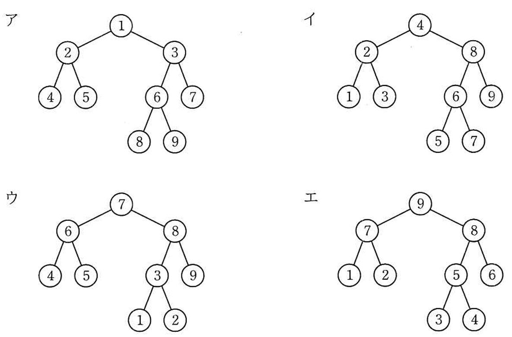
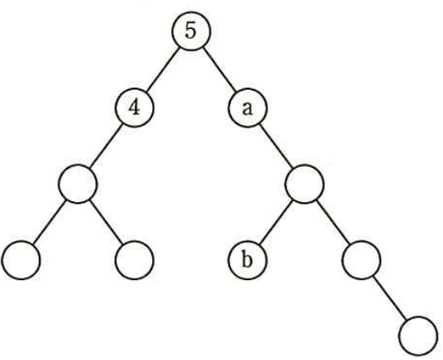
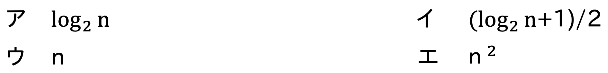

# Day09（2026/07/26）
## 学習結果

- 実施問題数：20問
- 正解：18問
- 不正解：2問
- 正答率：90%
- 学習時間：2時間15分

---

## 学習内容

### キューとスタック

- キュー
  - 待ち行列とも言われる、最初に格納したデータから順に処理を行う、FIFO(<ruby>First In First Out<rp>(</rp><rt>ファースト イン ファースト アウト</rt><rp>)</rp></ruby>)方式のデータ構造
    - <ruby>enqueue<rp>(</rp><rt>エンキュー</rt><rp>)</rp></ruby>
      - キューに入れる操作
    - <ruby>dequeue<rp>(</rp><rt>デキュー</rt><rp>)</rp></ruby>
        - キューから出す操作
- スタック
  - キューの逆で、最後に格納したデータから順に処理を行う、後入れ先出しLIFO（<ruby>Last In First Out<rp>(</rp><rt>ラスト イン ファースト アウト</rt><rp>)</rp></ruby>）方式のデータ構造。
    - <ruby>PUSH<rp>(</rp><rt>プッシュ</rt><rp>)</rp></ruby>
      - スタックに入れる操作
    - <ruby>POP<rp>(</rp><rt>ポップ</rt><rp>)</rp></ruby>
      - スタックから出す操作

---

### 木構造
階層構造を持つデータで広く用いられる他、<br>
データの探索や整列などの用途にも使われるデータ構造。

- バランス木
  - 深さが一定の木構造
- 二分木
  - 子が最大で２つまでの木構造
- 完全二分木
  - 葉以外の節がすべて２つの子を持ち、根から葉までの深さが一様に等しい二分木
- 二分探索木
  - 親に対する左部分木と右部分木の関係が、「**左の子 ＜ 親 ＜ 右の子**」となる二分木
    ここで言う「子」は、その部分木に含むすべての節を指す

---

### 探索

- 線形探索法
  - 先頭から順に探索していく方法
- ２分探索法
  - 探索対象データ群が「昇順」または「降順」に並んでいる前提が必要。
    順番に並んだデータ群の中から、真ん中の値と比べながら、探索範囲を毎回半分に絞って高速に見つける方法。
- ハッシュ法
  - **ハッシュ関数**と呼ばれる一定の計算式を用いて、データの格納位置をズバリ算出する探索方法

---

### 整列

- バブルソート（基本交換法）
  - 隣接するデータの大小を比較、必要に応じて入れ替える事で全体を整列させる
- 選択ソート（基本選択法）
  - 対象とするデータの中から最小値（もしくは最大値）のデータを取り出して、先頭のデータと交換。
    これを繰り返すことで全体を整列させるのが選択ソートです。
- 挿入ソート（基本挿入法）
  - 対象とするデータを「整列済み」と「未整列」に分け、
    未整列の側から、ひとつずつ整列済みの列の「適切な位置」に挿入して、全体を整列させる
- シェルソート
  - 一定間隔置きに取り出した要素で部分列を作り、それぞれ整列してもとに戻す。
    今度はさらに間隔をつめて要素を取り出し、再度整列。
    取り出す間隔が１になるまでこれを繰り返す。
- クイックソート
  - 中間的な基準値を決めて、「それより小さい値」グループと「それより大きい値」グループに振り分ける。
    それぞれのグループ内でまた基準値を決めて振り分けて・・・と繰り返すことで整列を行う方法。
- ヒープソート
  - 未整列の部分を「順序木」といわれる木構造に構成して、そこから最大値もしくは最小値を取り出して整列済みの側へ移します。
    これを繰り返すことで、未整列部分を縮めながら整列を行う方法です。

---

### プログラムの４つの性質

- 再配置可能（リロケータブル）
  - 主記憶上の、どこに配置しても実行することができる。
- 再入可能（リエントラント）
  - 再ロードすることなく繰り返し実行できる再使用可能プログラムにおいて、
    複数のタスクから呼び出しても互いに干渉することなく同時実行することができる。
- 再使用可能（リユーザブル）
  - 主記憶上にロードされて処理を終えたプログラムを、再ロードすることなく繰り返し実行することができる
    （そして毎回正しい結果を得る事ができる）
- 再帰的（リカーシブ）
  - 実行中に、自分自身を呼び出すことができる

---
## 練習問題

### 問題１：✅
あるキューに要素 "33"、要素 "27" 及び要素 "12" の三つがこの順序で格納されている。<br>
このキューに要素 "45" を追加した後に要素を二つ取り出す。<br>
2番目に取り出される要素はどれか。

【選択肢】

1. 12
2. 27
3. 33
4. 45

回答：２

<details><summary>【解答・解説】</summary><div>
答え：２<br>
<br>
</div></details>

---

### 問題２：✅
複数のデータが格納されているスタックからのデータの取出し方として、適切なものはどれか。

【選択肢】
1. 格納された順序に関係なく指定された任意の場所のデータを取り出す。
2. 最後に格納されたデータを最初に取り出す。
3. 最初に格納されたデータを最初に取り出す。
4. データがキーをもっており、キーの優先度でデータを取り出す。

回答：２

<details><summary>【解答・解説】</summary><div>
答え：２<br>
<br>
</div></details>

---

### 問題３：✅
待ち行列に対する操作を、次のとおり定義する。<br>
* ENQ n：待ち行列にデータ n を挿入する。
* DEQ：待ち行列からデータを取り出す。
空の待ち行列に対し、ENQ 1、ENQ 2、ENQ 3、DEQ、ENQ 4、ENQ 5、DEQ、ENQ 6、DEQ、DEQ の操作を行った。<br>
次に DEQ 操作を行ったとき、取り出される値はどれか。

【選択肢】
1. 1
2. 2
3. 5
4. 6

回答：３

<details><summary>【解答・解説】</summary><div>
答え：３<br>
<br>
</div></details>

---

### 問題４：✅
A, B, C, D の順に到着するデータに対して、一つのスタックだけを用いて出力可能なデータ列はどれか。

【選択肢】
1. A,D,B,C
2. B,D,A,C
3. C,B,D,A
4. D,C,A,B

回答：３

<details><summary>【解答・解説】</summary><div>
答え：３<br>
<br>
</div></details>

---

### 問題５：✅
空の状態のキューとスタックの二つのデータ構造がある。<br>
次の手続きを順に実行した場合、変数 x に代入されるデータはどれか。<br>
ここで、手続で引用している関数は、次のとおりとする。<br>
<br>
【関数の定義】
* push(y)：データ y をスタックに積む。
* pop()：データをスタックから取り出して、その値を返す。
* enq(y)：データ y をキューに挿入する。
* deq()：データをキューから取り出して、その値を返す。

【手続】
* push(a)
* push(b)
* enq(pop())
* enq(c)
* push(d)
* push(deq())
* x ← pop()

【選択肢】
1. a
2. b
3. c
4. d

回答：２

<details><summary>【解答・解説】</summary><div>
答え：２<br>
<br>
</div></details>

---

### 問題６：✅
2分探索木として適切なものはどれか。<br>
ここで、数字 1～9 は、各ノード（節）の値を表す。<br>


【選択肢】
1. ア
2. イ
3. ウ
4. エ

回答：２

<details><summary>【解答・解説】</summary><div>
答え：２<br>
<br>
</div></details>

---

### 問題７：❌
10個の節（ノード）から成る次の2分木の各節に、1から10までの値を一意に対応するように割り振ったとき、節a, bの値の組合せはどれになるか。<br>
ここで、各節に割り振る値は、左の子及びその子孫に割り振る値よりも大きく、右の子及びその子孫に割り振る値よりも小さくするものとする。<br>


【選択肢】
1. a = 6, b = 7
2. a = 6, b = 8
3. a = 7, b = 8
4. a = 7, b = 9

回答：２<br>

<details><summary>【解答・解説】</summary><div>
答え：１<br>
<br>
二分探索木では

``` text
左 → 親 → 右
```
の順でたどると
``` text
1
2
3
4
5
6
7
8
9
10
```
になります。<br>
<br>
つまり
``` text
中順巡回 = 昇順
```
です。<br>
<br>
例えば木が
``` text
        ○
      /   \
    ○      ○
   / \    / \
```
なら
``` 
左端
 ↓
左
 ↓
親
 ↓
右
 ↓
右端
```
という順番になります。<br>
<br>
今回も同じように
```text
左へ行けるだけ進む
↓
一番左の節に「1」を割り当てる
↓
親へ戻って「2」を割り当てる
↓
右の節へ進み「3」を割り当てる
↓
これを繰り返す
・・・
```
と番号を書いていきます。<br>
<br>
すると
```text
a = 6
b = 7
```
になります。<br>
<br>
</div></details>

---

### 問題８：✅
2,000個の相異なる要素が，キーの昇順に整列された表がある。<br>
外部から入力したキーによってこの表を2分探索して，該当するキーの要素を取り出す。<br>
該当するキーが必ず表中にあることが分かっているとき，キーの比較回数は最大何回か。

【選択肢】
1. 9
2. 10
3. 11
4. 12

回答：３

<details><summary>【解答・解説】</summary><div>
答え：３<br>
<br>
</div></details>

---

### 問題９：✅
2分探索において，データの個数が4倍になると，最大探索回数はどうなるか。

【選択肢】
1. 1回増える
2. 2回増える
3. 約2倍になる
4. 約4売になる

回答：２

<details><summary>【解答・解説】</summary><div>
答え：２<br>
<br>
</div></details>

---

### 問題１０：✅
昇順に整列された個のデータが配列に格納されている。<br>
探索したい値を2分探索法で探索するときの，およその比較回数を求める式はどれか。<br>


【選択肢】
1. ア
2. イ
3. ウ
4. エ

回答：１

<details><summary>【解答・解説】</summary><div>
答え：１<br>
<br>
</div></details>

---

### 問題１１：✅
表探索におけるハッシュ法の特徴はどれか。

【選択肢】
1. 2分木を用いる方法の一種である。
2. 格納場所の衝突が発生しない方法である。
3. キーの関数値によって格納場所を決める。
4. 探索に要する時間は表全体の大きさにほぼ比例する。

回答：３

<details><summary>【解答・解説】</summary><div>
答え：３<br>
<br>
</div></details>

---

### 問題１２：✅
2分探索に関する記述のうち，適切なものはどれか。

【選択肢】
1. 2分探索するデータ列は整列されている必要がある。
2. 2分探索は線形探索より常に速く探索できる。
3. 2分探索は探索をデータ列の先頭から開始する。
4. n個のデータの探索に要する比較回数は、nlog2nに比例する。

回答：１

<details><summary>【解答・解説】</summary><div>
答え：１<br>
<br>
</div></details>

---

### 問題１３：✅
バブルソートの説明として適切なものはどれか。

【選択肢】

1. ある間隔おきに取り出した要素から成る部分列をそれぞれ整列し、更に間隔を詰めて同様の操作を行い、間隔が1になるまでこれを繰り返す。
2. 中間的な基準値を決めて、それよりも大きな値を集めた区分と、小さな値を集めた区分に要素を振り分ける。次に、それぞれの区分の中で同様の操作を繰り返す。
3. 隣り合う要素を比較して、大きいの順が逆であれば、それらの要素を入れ替えるという操作を繰り返す。
4. 未整列の部分を順序木にし、そこから最小値を取り出して整列済の部分に移す。この操作を繰り返して、未整列の部分を縮めていく。

回答：３

<details><summary>【解答・解説】</summary><div>
答え：３<br>
<br>
</div></details>

---

### 問題１４：✅
クイックソートの処理方法を説明したものはどれか。

【選択肢】
1. 既に整列済みのデータ列の正しい位置に，データを追加する操作を繰り返していく方法である。
2. データ中の最小値を求め，次にそれを除いた部分の中から最小値を求める。この操作を繰り返していく方法である。
3. 適当な基準値を選び，それより小さな値のグループと大きな値のグループにデータを分割する。同様にして，グループの中で基準値を選び，それぞれのグループを分割する。この操作を繰り返していく方法である。
4. 隣り合ったデータの比較と入替えを繰り返すことによって，小さな値のデータを次第に端のほうに移していく方法である。

回答：３

<details><summary>【解答・解説】</summary><div>
答え：３<br>
<br>
</div></details>

---

### 問題１５：✅
4つの数の並び（４、１、３、２）を、ある整列アルゴリズムに従って昇順に並べ替えたところ、数の入れ替えは次の通り行われた。<br>
この整列アルゴリズムはどれか。
<br>
（１、４、３、２）
（１、３、４、２）
（１、２、３、４）
<br>
【選択肢】
1. クイックソート
2. 選択ソート
3. 挿入ソート
4. バブルソート

回答：３

<details><summary>【解答・解説】</summary><div>
答え：３<br>
<br>
</div></details>

---

### 問題１６：✅
複数のプロセスから同時に呼び出された時に、互いに干渉することなく並行して動作することができるプログラムの性質を表すものはどれか。

【選択肢】
1. リエントラント
2. リカーシブ
3. リユーザブル
4. リロケータブル

回答：１

<details><summary>【解答・解説】</summary><div>
答え：１<br>
<br>
</div></details>

---

### 問題１７：✅
再入可能プログラムの特徴はどれか。

【選択肢】
1. 主記憶上のどこかのアドレスに配置しても、実行することができる。
2. 手続の内部から自分自身を呼び出すことができる。
3. 必要な部分を補助記憶装置から読み込みながら動作する。主記憶領域の大きさに制限があるときに、有効な手法である。
4. 複数のタスクからの呼び出しに対して、並行して実行されても、それぞれのタスクに正しい結果を返す。

回答：４

<details><summary>【解答・解説】</summary><div>
答え：４<br>
<br>
</div></details>

---

### 問題１８：✅
再帰呼出しの説明はどれか。

【選択肢】
1. あらかじめ決められた順番ではなく、起きた事象に応じた処理を行うこと
2. 関数の中で自分自身を用いた処理を行うこと
3. 処理が終了した関数をメモリから消去せず、必要になったとき再び用いること
4. 処理に失敗したときに、その処理を呼び出す直前の状態に戻すこと

回答：２

<details><summary>【解答・解説】</summary><div>
答え：２<br>
<br>
</div></details>

---

### 問題１９：✅
プログラムの特性に関する記述のうち，適切なものはどれか。

【選択肢】
1. 再帰的プログラムは再入可能な特性をもち、呼び出されたプログラムの全てがデータを共有する。
2. 再使用可能プログラムは実行の始めに変数を初期化する、又は変数を初期状態に戻した後にプログラムを終了する。
3. 再入可能プログラムは、データとコードの領域を明確に分離して、両方を各タスクで共有する。
4. 再配置可能なプログラムは、実行の都度、主記憶装置上の定まった領域で実行される。

回答：２

<details><summary>【解答・解説】</summary><div>
答え：２<br>
<br>
</div></details>

---

### 問題２０：❌
自然数 n に対して、次のとおり再帰的に定義される関数 f(n) を考える。<br>
f(5) の値はどれか。<br>
<br>
f(n):if n≦1 then return 1 else return n+f(n−1)

【選択肢】
1. 6
2. 9
3. 15
4. 25

回答：回答：未回答（解説のみ確認）

<details><summary>【解答・解説】</summary><div>
答え：３<br>
<br>

1. まず式を書く
  ```text
  f(5)
  
  = 5 + f(4)
  ```
  まだf(4)は分からないので、そのまま残します。<br>
  <br>
2. f(4)を展開する
  ```text
  f(4)
  
  = 4 + f(3)
  ```
  これを代入すると
  ```text
  5 + (4 + f(3))
  ```
  になります。<br>
  <br>
3. f(3)
  ```text
  = 3 + f(2)
  ```
  これを代入すると
  ```text
  5 + (4 + (3 + f(2)))
  ```
  になります。<br>
  <br>
4. f(2)
  ```text
  = 2 + f(1)
  ```
  これを代入すると
  ```text
  5 + (4 + (3 + (2 + f(1))))
  ```
  になります。<br>
  <br>
5. f(1)
  ここで条件
  ```
  n <= 1
  ```
  なので
  ```
  f(1)=1
  ```
  になります。<br>
  <br>
6. 戻りながら計算
  ```
  5 + (4 + (3 + (2 + 1)))
  =5 + (4 + (3 + 3))
  =5 + (4 + 6)
  =5 + 10
  =15
  ```
<br>
</div></details>

---

## 振り返り

- キュー（FIFO）とスタック（LIFO）の違い、および enqueue・dequeue・push・pop の操作を整理できた。
- 二分探索木では、左部分木 ＜ 親 ＜ 右部分木 の関係を利用し、中順巡回（左→親→右）で節をたどると値が昇順になることを理解した。
- 二分探索は整列済みデータを前提とし、探索範囲を半分ずつ絞ることで比較回数を大幅に減らせることを学んだ。
- バブルソート・選択ソート・挿入ソート・クイックソートなど、それぞれの整列アルゴリズムの特徴と処理方法を整理できた。
- リロケータブル・リエントラント・リユーザブル・リカーシブの4つのプログラム特性について、それぞれの意味と違いを理解した。
- 再帰関数では、関数呼び出しを一段ずつ展開してから値を求める考え方を復習する必要がある。
- 二分探索木の問題では、節の位置ではなく、中順巡回で1から順番に値を割り当てることを意識すると解きやすくなる。
