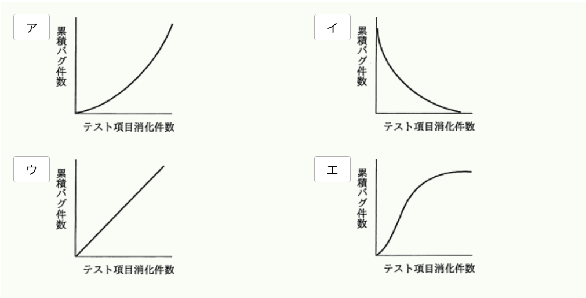
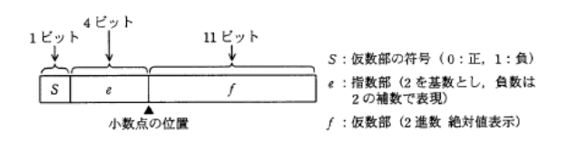
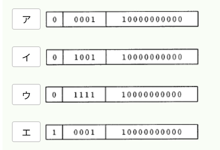

# 過去問演習（2026/07/08）

## 範囲

- プロジェクトマネジメント

## 結果

- 問題数：問
- 正解：問
- 不正解：問
- 正答率：%

## 過去問道場

### 分類：マネジメント系 >> プロジェクトマネジメント >> プロジェクトの品質

### 問題１：✅
品質の定量評価の指標のうち、ソフトウェアの保守性の評価指標になるのはどれか。

【選択肢】

1. （最終成果物に含まれる誤りの件数）÷（最終成果物の量）
2. （修正時間の合計）÷（修正件数）
3. （変更が必要となるソースコードの行数）÷（移植するソースコードの行数）
4. （利用者からの改良要求件数）÷（出荷後の経過月数）

回答：２

【解答・解説】

答え：２ 
 
ソフトウェア品質の主な特性と意味は次の通りです。

- 機能性 - 必要性に合致する機能を提供する能力
- 信頼性 - 指定された達成水準を維持する能力
- 使用性 - 理解、習得、利用でき、利用者にとって魅力的である能力
- 効率性 - 使用する資源の量に対比して適切な性能を提供する能力
- 保守性 - 修正のしやすさに関する能力
- 移植性 - ある環境から他の環境に移すための能力

JIS X 0129-1（ソフトウェア製品の品質）の定義によれば、 
保守性は「修正のしやすさに関するソフトウェア製品の能力」とされています。 
保守性が高いかどうかは、そのソフトウェアを修正する際にどれだけのコストがかかるかによって判断されます。 

- （最終成果物に含まれる誤りの件数）÷（最終成果物の量） 
`残存バグ数の割合を表す式です。信頼性の評価指数に該当します。`
- （修正時間の合計）÷（修正件数） 
`修正１件当たりに要した時間を示す式です。ソフトウェア修正にかかるコストを表すため、保守性の評価指標として適切です。`
- （変更が必要となるソースコードの行数）÷（移植するソースコードの行数） 
`移植時に変更が必要なソースコードの割合を示す式です。移植性の評価指標に該当します。`
- （利用者からの改良要求件数）÷（出荷後の経過月数） 
`突き当りの改良要求件数を示す式です。機能性の評価指標に該当します。`
 

---

### 分類：マネジメント系 >> プロジェクトマネジメント >> プロジェクトの品質

### 問題２：✅
テスト工程での品質状況を判断するためには、テスト項目消化件数と累積バグ件数との関係分析し、評価する必要がある。 
品質が安定しつつあることを表しているグラフはどれか。

【選択肢】

回答：エ

【解答・解説】

答え：エ 
 

---

### 分類：マネジメント系 >> プロジェクトマネジメント >> プロジェクトのコスト

### 問題３：✅
ある新規システムの機能規模を見積もったところ、500FP（ファンクションポイント）であった。 
このシステムを構築するプロジェクトには、開発工数のほかに、システム導入と開発者教育の工数が 
合計で10人月ある。 
また、プロジェクト管理に、開発と導入・教育を合わせた工数の10%を要する。 
このプロジェクトに要する全工数は何人月か。 
開発の生産性は１人月あたり10FPとする。

【選択肢】
1. 51
2. 60
3. 65
4. 66

回答：４

【解答・解説】

答え：４ 

1. 見積もられた開発工数500FPにシステム導入と開発者教育の工数を加算する。 
    **500FP +  (10人月 × 10FP) = 600FP**
2. プロジェクト管理に要する全体の10%の工数を加算する。 
    **600FP + (600FP × 0.1) = 660FP**
3. FPを開発の生産性で割って、人月の単位に直す。 
    **660FP ÷ 10FP = 66人月**
 

---
### 分類：テクノロジ系 >> 基礎理論 >> 離散数学

### 問題４：❌
数値を図に示す16ビットの浮動小数点形式で表すとき、10進数0.25を正規化した表現はどれか。 
ここでの正規化は、仮数部の最上位けたが0にならないように指数部と仮数部を調節する操作とする。

【選択肢】

回答：ア

【解答・解説】

答え：ウ 

1. 10進数0.25を2進数に変換する。 
    **0.25 → 0.01**
2. 0.01を正規化する。 
    **0.1 × $2^{-1}$**
3. 正規化した **0.1 × $2^{-1}$** を浮動小数点形式の各桁に当てはめる。

#### 原因
* 正規化する際、小数点を **右** に１つ移動させたのに指数を「１」として考えた。

#### 覚えること
* 指数は小数点を右に移動したらマイナス、左に移動したらプラスになる。 
 

---
### 分類：テクノロジ系 >> 基礎理論 >> 応用数学

### 問題５：✅❌
相関係数に関する記述のうち、適切なものはどれか。

【選択肢】
1. すべての標本点が正の傾きをもつ直線状にあるときは、相関係数が＋１になる
2. 変量間の関係が線形のときは、相関係数が０になる。
3. 変量間の関係が非線形のときは、相関係数が負になる。
4. 無相関のときは、相関係数がー１になる。

回答：

【解答・解説】

答え： 
 

---

### 問題６：✅❌
問題文

【選択肢】

回答：

【解答・解説】

答え： 
 

---

### 問題７：✅❌
問題文

【選択肢】

回答： 

【解答・解説】

答え： 
 

---

### 問題８：✅❌
問題文

【選択肢】

回答：

【解答・解説】

答え： 
 

---

### 問題９：✅❌
問題文

【選択肢】

回答：

【解答・解説】

答え： 
 

---

### 問題１０：✅❌
問題文

【選択肢】

回答：

【解答・解説】

答え： 
 

---

### 問題１１：✅❌
問題文

【選択肢】

回答：

【解答・解説】

答え： 
 

---

### 問題１２：✅❌
問題文

【選択肢】

回答：

【解答・解説】

答え： 
 

---

### 問題１３：✅❌
問題文

【選択肢】

回答：

【解答・解説】

答え： 
 

---

### 問題１４：✅❌
問題文

【選択肢】

回答：

【解答・解説】

答え： 
 

---

### 問題１５：✅❌
問題文

【選択肢】

回答：

【解答・解説】

答え： 
 

---

### 問題１６：✅❌
問題文

【選択肢】

回答：

【解答・解説】

答え： 
 

---

### 問題１７：✅❌
問題文

【選択肢】

回答：

【解答・解説】

答え： 
 

---

### 問題１８：✅❌
問題文

【選択肢】

回答：

【解答・解説】

答え： 
 

---

### 問題１９：✅❌
問題文

【選択肢】

回答：

【解答・解説】

答え： 
 

---

### 問題２０：✅❌
問題文

【選択肢】

回答：

【解答・解説】

答え： 
 

---

## 間違えた問題

### 問題１

原因
- 

復習
- 

---

### 問題２

原因
- 

復習
- 