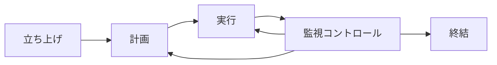
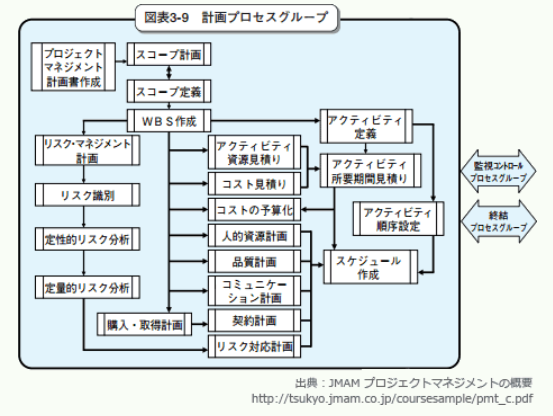
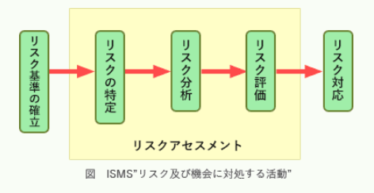

# 過去問演習（2026/08/08）

## 範囲

- マネジメント系
  - プロジェクトマネジメント
  - サービスマネジメント
  - システム監査
- テクノロジ系
  - 基礎理論
  - アルゴリズムとプログラミング
  - コンピュータ構成要素
  - システム構成要素

## 結果

- 問題数：●問
- 正　解：●問
- 不正解：●問
- 正答率：●%

## 過去問道場

### 分類：テクノロジ系 >> コンピュータ構成要素 >> プロセッサ
#### 問題１：✅
主記憶に記憶されたプログラムを、CPUが順に読み出しながら実行する方式はどれか。

【選択肢】
1. DMA制御方式
2. アドレス指定方式
3. 仮想記憶方式
4. プログラム格納方式

回答：４

<details><summary>【解答・解説】</summary><div>
答え：４<br>
<br>
</div></details>

---

### 分類：マネジメント系 >> サービスマネジメント >> サービスマネジメント
#### 問題２：✅
ミッションクリティカルシステムの意味として、適切なものはどれか。

【選択肢】<br>
1. OSなどのように、業務システムを稼働させる上で必要不可欠なシステム
2. システム運用条件が、性能の限界に近い状態の下で稼働するシステム
3. 障害が起きると、企業活動に重大な影響を及ぼすシステム
4. 先行して試験導入され、成功すると本格的に導入されるシステム

回答：３

<details><summary>【解答・解説】</summary><div>
答え：３<br>
<br>

**ミッションクリティカルシステム**は、障害発生などによってシステムが中断・停止すると巨額の損失や信用の失墜などの致命的な問題を招く可能性が高く、24時間365日止まることを許されないシステムをいいます。<br>
交通機関や金融機関の基幹システム、およびECサイトの基幹システムなどがミッションクリティカルシステムの例で、これらのシステムでは停止をさせないために極めて高い信頼性や耐障害性、保守性などが要求されます。<br>
<br>
したがって適切な記述は「ウ」になります。ちなみに「エ」はパイロットシステムに関する記述です。<br>
<br>
</div></details>

---

### 分類：テクノロジ系 >> コンピュータ構成要素 >> 入出力装置
#### 問題３：✅
分6,000回転、平均位置決め時間20ミリ秒で、1トラック当たりの記憶容量20kバイトの磁気ディスク装置がある。<br>
1ブロック4kバイトのデータを1ブロック転送するのに要する平均アクセス時間は何ミリ秒か。<br>
ここで、磁気ディスクリコーラーのオーバーヘッドは無視できるものとし、1kバイト＝1,000バイトとする。

【選択肢】
1. 20
2. 22
3. 27
4. 32

回答：３

<details><summary>【解答・解説】</summary><div>
答え：３<br>
<br>
磁気ディスクのアクセス時間は以下の式で求められます。<br>
<br>

```text
平均シーク時間 + 平均回転待ち時間 + データ転送時間
```

* **平均位置決め（シーク）時間（平均シークタイム）**
磁気ディスクのヘッドが、目的のデータが保存されている位置まで移動するのにかかる時間の平均。

* **平均回転待ち時間（サーチタイム）**
ヘッドの移動が完了した後、読み出しコードの先頭が磁気ヘッドの位置まで磁気ディスクが回転してくるのを待つ時間の平均。この時間は、ディスクが1回転するのにかかる時間の半分が平均回転待ち時間となる。

* **データ転送時間**
目的のデータを読み出すのに要する時間。
<br>
平均位置決め時間は20ミリ秒と仮定しており、その他の計算は以下の通りです。<br>
<br>
磁気ディスクが1秒間に回転する回数は6,000回／分なので、
```
60秒 ÷ 6,000回 = 10ミリ秒／回
```
となる。<br>
<br>
平均回転待ち時間は、ディスク1回転にかかる時間の半分なので、
```
10ミリ秒 ÷ 2 = 5ミリ秒
```
<br>
1トラック（1回転）あたりのデータ容量は20kバイト。4kバイトのデータを読むのに必要な時間は、

```
10ミリ秒 × (4,000 ÷ 20,000) = 2ミリ秒
```
<br>
すべての時間を足し合わせると、

```
20 + 5 + 2 = 27ミリ秒
```
したがって、正しい平均アクセス時間は**27ミリ秒**です。
<br>
</div></details>

---

### 分類：テクノロジ系 >> システム構成要素 >> システムの構成
#### 問題４：✅
クライアントサーバシステムの特徴として、適切なものはどれか。

【選択肢】
1. クライアントとサーバが協調して、目的の処理を遂行する分散処理形態であり、サービスという概念で機能を分割し、サーバがサービスを提供する。
2. クライアントとサーバが協調しながら共通のデータ資源にアクセスするために、システム構成として密結合システムを採用している。
3. クライアントは、多くのサーバからの要求に対して、互いに協調しながら同時にサービスを提供し、サーバからのクライアント資源へのアクセスを制御する。
4. サービスを提供するクライアント内に設置するデータベースも、規模に対応して柔軟に拡大することができる。

回答：１

<details><summary>【解答・解説】</summary><div>
答え：１<br>
<br>

**クライアントサーバシステム**は、システムの機能を、サービスの要求と処理結果の出力の役割をもつクライアント、要求された処理（サービス）を専門に行うサーバに分けた分散処理形態の一種です。<br>
サーバには、データベースサーバ、プリントサーバ、ファイルサーバなど様々なものがあります。<br>
各サーバが特定の処理を行うようにそれぞれが独立していますから、各機能の性能向上が容易である特徴があります。<br>
<br>
</div></details>

---

### 分類：マネジメント系 >> サービスマネジメント >> サービスの運用
#### 問題５：✅
アプリケーションの保守に関する記述として、適切なものはどれか。

【選択肢】
1. テスト終了後は速やかに本稼働中のライブラリにプログラムを登録し、保守承認者に報告する。
2. 変更内容が簡単であると判断できるときは、本稼働用のライブラリを直接更新する。
3. 保守作業が完了しないまま放置されるのを防ぐためにも、保守の完了を記録する。
4. 保守作業は、保守作業担当者によるテストが終了した時点で完了とする。

回答：３

<details><summary>【解答・解説】</summary><div>
答え：３<br>

##### 解説：

1. “テスト終了後は速やかに本稼働中のライブラリにプログラムを登録し、保守承認者に報告する。” 　本稼働環境への移行作業は、保守承認者の承認を得た後に実施します。
2. “変更内容が簡単であると判断できるときは、本稼働用のライブラリを直接更新する。” 　たとえ変更内容が簡単であっても、移行中または移行後に予想外の事象が起こり本稼働環境に影響を与える可能性があります。このため本稼働環境に移す前には必ずテストを実施すべきです。
3. “保守作業が完了しないまま放置されるのを防ぐためにも、保守の完了を記録する。” 　正しい。
4. “保守作業は、保守作業担当者によるテストが終了した時点で完了とする。” 　保守作業は、本稼働環境への移行完了までを含みます。
<br>
</div></details>

---

### 分類：テクノロジ系 >> コンピュータ構成要素 >> メモリ
#### 問題６：✅
組込みシステムのプログラムを格納するメモリとして、マスクROMを使用するメリットはどれか。

【選択肢】
1. 紫外線照射で内容を消去することによって、メモリ部品を再利用することができる。
2. 出荷後のプログラムの不正な書換えを防ぐことができる。
3. 製品の量産後にシリアル番号などの個体識別データを書き込むことができる。
4. 動作中に主記憶が不足した場合、補助記憶として使用することができる。

回答：２

<details><summary>【解答・解説】</summary><div>
答え：２<br>

##### 解説：

**マスクROM**は、電源を切っても記憶している内容を保持する性質を持つROM（Read Only Memory）の一種で、<br>
特に記録されている内容を書き換えることができないメモリのことを指します。<br>
集積回路の配線によって記憶情報を構成し、読み出せる内容が半導体製造に用いるフォトマスクによって固定されることから、<br>
**マスクROM**と呼ばれます。
<br>
組込みシステムを動作させるためのソフトウェアであるファームウェアには、ハードウェアと密接に結びついていたり、<br>
CPU自体の動作を決定するコードを含んでいることがあります。<br>
これらの機器に重大な影響を及ぼす可能性のあるデータをむやみに書き換えられないようにするための記憶媒体として<br>
マスクROMが用いられています。<br>
<br>
</div></details>

---

### 分類：マネジメント系 >> プロジェクトマネジメント >> プロジェクトの統合
#### 問題７：✅
プロジェクトマネジメントのプロセスのうち、計画プロセスグループ内で実施するプロセスはどれか。

【選択肢】
1. スコープの定義
2. ステークホルダの特定
3. 品質保証の実施
4. プロジェクト憲章の作成

回答：１<br>

<details><summary>【解答・解説】</summary><div>
答え：１<br>

##### 解説：

PMBOKではプロジェクトマネジメントのプロセスは、「立ち上げ」「計画」「実行」「監視・コントロール」「終結」の5つのプロセスグループで構成され、各プロセスは10の知識エリア（サブジェクトグループ）に分類されています。

- 立ち上げ
  - プロジェクトを開始する必要性の明確化、および組織としてプロジェクトに着手することの宣言を行う。
- 計画
  - 要求を満足するための、実行可能な作業の仕組みを確立し、およびその仕組みを維持する。
- 実行
  - 人及びその資源を活用し、計画を実行する。
- 監視・コントロール
  - 進捗の監視・測定、および予定・実績の相違の検出と是正措置を実行する。
- 終結
  - プロジェクトの結果の文書化、および顧客による検収の確認、プロジェクトの完了手続きを行う。



このうち計画プロセスグループには以下のプロセスが含まれています。<br>
<div style = "text-align: center;"></div><br>

1. スコープの定義：計画プロセスグループに含まれるプロセス
2. ステークホルダの特定：立ち上げプロセスグループに含まれるプロセス
3. 品質保証の実施：実行プロセスグループに含まれるプロセス
4. プロジェクト憲章の作成：立ち上げプロセスグループに含まれるプロセス
<br>
</div></details>

---

### 分類：テクノロジ系 >> 基礎理論 >> 離散数学
#### 問題８：✅
X・Y・Z ＋ $\overline{X}$・Y・Z などの論理式はどれか。<br>
ここで、「・」は論理積、「+」は論理和、$\overline{X}$はXの否定を表す。

【選択肢】
1. X・Y・Z
2. $\overline{X}$・(Y＋Z)
3. Y・Z
4. Y＋Z

回答：３

<details><summary>【解答・解説】</summary><div>
答え：３<br>

##### 解説：

X・Y・Z ＋ $\overline{X}$・Y・Zをベン図で表すと次のようになります。<br>
<br>
同様に選択肢の論理式もベン図で表して検証します。

1. X・Y・Z<br>
   <div style = "text-align: center;"></div><br>
2. $\overline{X}$・(Y＋Z)<br>
   <div style = "text-align: center;"></div><br>
3. Y・Z<br>
   <div style = "text-align: center;"></div><br>
4. Y＋Z<br>
   <div style = "text-align: center;"></div><br>

また次のように論理演算の法則を用いて答えを導くこともできます。<br>
<br>
&nbsp;&nbsp;&nbsp;X・Y・Z ＋ $\overline{X}$・Y・Z<br>
= Y・Z・(X + $\overline{X}$) //分配の法則<br>
= Y・Z //X + $\overline{X}$ = 1
<br>
</div></details>

---

### 分類：マネジメント系 >> システム監査 >> システム監査
#### 問題９：❌
JIS Q 27001:2014（情報セキュリティマネジメントシステム－要求事項）に基づいてISMS内部監査を行った結果として判明した状況のうち、<br>
監査人が指摘事項として監査報告書に記載すべきものはどれか。

【選択肢】
1. USBメモリの使用を、定められた手順に従って許可していた。
2. 個人情報の誤廃棄事故を主務官庁などに、規定されたとおりに報告していた。
3. マルウェアスキャンでスパイウェアが検知され、駆除されていた。
4. リスクアセスメントを実施した後に、リスク受容基準を決めた。

回答：１

<details><summary>【解答・解説】</summary><div>
答え：４<br>

##### 解説：

1. USBメモリの使用を、定められた手順に従って許可していた。<br>
資産の取扱いに関する手順は、「組織が採用した情報分類体系に従って策定し、実施する」こととされているので問題ありません。

2. 個人情報の誤廃棄事故を主務官庁などに、規定されたとおりに報告していた。<br>
関係当局との適切な連絡体制を維持し、“法が破られたと疑われる場合に、特定した情報セキュリティインシデントをいかにして時機を失せずに報告するかの手順を備える”こととされているので問題ありません。

3. マルウェアスキャンでスパイウェアが検知され、駆除されていた。<br>
組織は、「不適合が発生した場合、不適合の正のための処置を取る」こととされているので問題ありません。

4. リスクアセスメントを実施した後に、リスク受容基準を決めた。<br>
正しい。リスク受容基準の決定時期が遅いので指摘事項に該当します。<br>
JIS Q 27001に基づくリスクマネジメントプロセスでは、リスクアセスメントを実施する前にリスク受容基準を確立することになっています。<br>
リスクアセスメントに含まれるリスク評価プロセスにおいて、リスク分析の結果とリスク受容基準を比較することになっているからです。<br>

<div style = "text-align: center;"></div><br>

</div></details>

---

### 分類：テクノロジ系 >> 基礎理論 >> 情報に関する理論
#### 問題１０：❌
次の状態遷移表をもつシステムの状態がS1であるときに、信号をt1, t2, t3, t4, t1, t2, t3, t4の順に入力すると、最後の状態はどれになるか。<br>
ここで、空欄は状態が変化しないことを表す。

| 信号 | 状態 | S1 | S2 | S3 | S4 |
|---|------|---|----|-|-|
| t1 |      | S3 |    | | | 
| t2 | S3   | | S2 |  | 
| t3 |      | |    | S4 | S1 | 
| t4 |      | |    | | S1 | S2 |

【選択肢】
1. S1
2. S2
3. S3
4. S4

回答：２

<details><summary>【解答・解説】</summary><div>
答え：１<br>

##### 解説：

1. [状態S1、入力t1] 空欄なので変化しません。
2. [状態S1、入力t2] S3に遷移します。
3. [状態S3、入力t3] S4に遷移します。
4. [状態S4、入力t4] S2に遷移します。
5. [状態S2、入力t1] S3に遷移します。
6. [状態S3、入力t2] S2に遷移します。
7. [状態S2、入力t3] 空欄なので変化しません。
8. [状態S2、入力t4] S1に遷移します。

| 信号 | 状態                             | S1                                 | S2 | S3 | S4 |
|---|----------------------------------|------------------------------------|---|---|---|
| t1 | <sup style="color: red;">1</sup> | S3<sup style="color: red;">5</sup> | | | | 
| t2 |                                  |                                    | S3 | | S2 | 
| t3 |                                  |                                    | | S4 | S1 | 
| t4 |                                  |                                    | | | S1 | S2 |

したがって最後の状態は「S1」になります。
<br>
</div></details>

---

## 振り返り

### 良かった点

- 
- 
- 

### 課題

