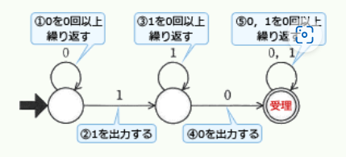

# テクノロジ系 要復習ノート

## 基礎理論

### 離散数学

#### 浮動小数点数の正規化

##### 問題:
数値を図に示す16ビットの浮動小数点形式で表すとき、10進数0.25を正規化した表現はどれか。<br>
ここでの正規化は、仮数部の最上位けたが0にならないように指数部と仮数部を調節する操作とする。<br>


【選択肢】<br>


<details><summary>【解答・解説】</summary><div>
答え：ウ<br>
<br>
1. 10進数0.25を2進数に変換する。<br>
    **0.25 → 0.01**
2. 0.01を正規化する。<br>
    **0.1 × $2^{-1}$**
3. 正規化した **0.1 × $2^{-1}$** を浮動小数点形式の各桁に当てはめる。

###### 原因
* 正規化する際、小数点を **右** に１つ移動させたのに指数を「１」として考えた。

###### 覚えること
* 指数は小数点を右に移動したらマイナス、左に移動したらプラスになる。<br>

</div></details>

---

#### 2の補数

##### 問題：
２の補数で表された負数10101110の絶対値はどれか。

【選択肢】
1. 01010000
2. 01010001
3. 01010010
4. 01010011

<details><summary>【解答・解説】</summary><div>
答え：３<br>

1. 負数である事を確認<br>
   `10101110`<br>
   先頭が**1**なので、**負の数**です。
2. ビットを反転する（１の補数）<br>
    ```
    10101110  
    ↓  
    01010001
    ```
   ０と１をすべて反転します。
3. １を足す
    ```
    01010001
   +       1
   ---------
    01010010
    ```
4. 絶対値になる
   `01010010`

###### 原因
* ＋１をしてから反転をした。

###### 覚えること
* 絶対値は反転をしてから＋１で求める。<br>
</div></details>

---

#### 仮数の正規化

##### 問題：
浮動小数点表示法における仮数が正規化されている理由として、適切なものはどれか。

【選択肢】
1. 固定少数点数とみなして大小関係が調べられるようにする。
2. 四則演算のアルゴリズムが簡素化できる。
3. 表現可能な数値の範囲を拡大する。
4. 有効数字のけた数を最大に保つ。

<details><summary>【解答・解説】</summary><div>
答え：４<br>
<br>
仮数の正規化とは、仮数部と指数部を調節することで、仮数部の最上位のけたを０以外にする操作をいいます。<br>
正規化は、演算による丸め誤差を最小限に抑え、有効けた数を最大に保つために行われます。<br>
<br>
</div></details>

---

### 応用数学

##### 問題：
相関係数に関する記述のうち、適切なものはどれか。

【選択肢】
1. すべての標本点が正の傾きをもつ直線状にあるときは、相関係数が＋１になる
2. 変量間の関係が線形のときは、相関係数が０になる。
3. 変量間の関係が非線形のときは、相関係数が負になる。
4. 無相関のときは、相関係数がー１になる。

<details><summary>【解答・解説】</summary><div>
答え：１<br>

**相関係数**は、２つの項目の関連度合いを示す値です。<br>
値として－１～＋１の間の実数値をとり、－１に近ければ負の相関、＋１に近ければ正の相関があると言います。<br>
逆に値が０に近い時には２項目間の相関は弱いと判断されます。<br>
正負の方向は相関の強さには関係しないので、負の相関と言っても、正に比べて関連性が弱いわけではありません。<br>
相関係数の絶対値の大きさ（１にどれだけ近いか）がそのまま相関性の強さを示します。<br>
<br>
1. 標本点がすべて直線状にあるということは、一方の値が決まればもう一方の値が決定するという比例関係になります。<br>
   このようなケースでは、相関係数は＋１となり、２項目間の関連度は最大と判断されます。
2. 変量間の関係が線形であれば、何らかの関係性があることが認められ、相関係数は０ではなくなります。
3. 相関係数が負の時には、負の傾きをもつ直線周辺に標本点が集まります。<br>
   非線形であれば相関係数は０に近づきます。
4. 無相関の時は、相関係数は０に近い値になります。
   <br>
</div></details>

---

### 情報に関する理論

#### オートマトン

##### 問題：
次の状態遷移図で表現されるオートマトンで受理されるビット列はどれか。<br>
ここで、ビット列は左から順に読み込まれるものとする。<br>


【選択肢】
1. 0000
2. 0111
3. 1010
4. 1111

<details><summary>【解答・解説】</summary><div>
答え：３<br>
<br>
設問のオートマトンでビット列が受理されるまでの流れは、<br>

1. "0"を0回以上繰り返す
2. "1"を出力する
3. "1"を0回以上繰り返す
4. "0"を出力する
5. "0"または"1"を0回以上繰り返したあと受理される
   となります。（下図参照）

<br>
２と４の手順に注目すると、"1"のあとには必ず１つ以上の"0"が含まれなければならない事がわかります。<br>
したがって、選択肢のうち受理可能なビット列は「1010」のみです。<br>
<br>
</div></details>

---

#### ディープラーニング

##### 問題：
AIにおけるディープラーニングに最も関連が深いものはどれか。

【選択肢】
1. ある特定の分野に特化した知識を基にルールベースの推論を行うことによって、専門家と同じレベルの問題解決を行う
2. 試行錯誤しながら条件を満たす解に到達する方法であり、場合分けを行い深さ優先で探索し、解が見つからなければ一つ前の場合分けの状態に後戻りする
3. 神経回路網を模倣した方法であり、多層に配置された素子と、それらを結ぶ信号線で構成されたモデルにおいて、信号線に不随するパラメータを調整することによって入力に対して適切な解が出力される。
4. 生物の進化を模倣した方法であり、与えられた問題の解の候補を記号列で表現して、それらを遺伝子に見立てて突然変異、交配、淘汰を繰り返して逐次的により良い解に近づける

<details><summary>【解答・解説】</summary><div>
答え：３<br>

**ディープラーニング**（DeepLearning）は、人間や動物の<span style="color: Tomato; font-weight: bold;">脳神経</span>をモデル化したアルゴリズム（ニューラルネットワーク）を多層化したものを用意し、<br>
それに「十分な量のデータを与えることで、人間の力なしに自動的に特徴点やパターンを学習させる」ことをいいます。<br>
<br>
ディープラーニングでは、脳の神経細胞であるニューロンの信号伝達をパーセプトロンというアルゴリズムで模倣し、<br>
それを大量かつ幾層にも繋ぎ合わせた疑似的な脳神経網ネットワークを使用して学習を行います。<br>
<br>
このネットワークに大量の学習用データ（入力値と正しい解の組み）を与え、損失関数や勾配法、誤差逆伝播法などの数学的なアプローチを用いて、<br>
出力と正しい解の差異が最小になるように中間層のパラメータ（重みとしきい値）を自動調整していきます。<br>
この仕組みにより、入力に対して最適解を出力するシステム（学習モデル）を得るのがディープラーニングです。<br>
学習させるデータが多いほど判定の精度も高まっていきます。<br>

1. エキスパートシステムに関する記述です。
2. 木構造やグラフ構造に対する「深さ優先探索」に関する記述です。
3. ディープラーニングに関する記述です。
4. コンピュータの制御に偶発的な要素を取り入れる「遺伝的アルゴリズム」に関する記述です。
<br>
</div></details>

---